# Habilidad de Agente Antigravity: Diagramado de Arquitectura C4 en Mermaid.js (/c4)

Esta habilidad capacita al agente de IA para actuar como un arquitecto visual de sistemas, generando diagramas interactivos en código **Mermaid.js** utilizando el **Modelo C4** (Simon Brown) respaldado por los Módulos 04 y 07 del Playbook de Ingeniería.

## 📚 Bloque de Referencias (Playbook & Knowledge Base)
* **Playbook de Ingeniería (Módulo 04 - Modelado C4):** [Guía Playbook Ingeniería y Operaciones](../../knowledge/Guía Playbook Ingeniería y Operaciones.md#módulo-04-arquitectura-diseño-de-sistemas-e-integraciones)
* **Playbook de Ingeniería (Módulo 07 - Docs-as-Code & Mermaid):** [Guía Playbook Ingeniería y Operaciones](../../knowledge/Guía Playbook Ingeniería y Operaciones.md#módulo-07-documentación-técnica-análisis-de-problemas-y-post-mortems)
* **Arquitectura Antigravity:** [Skills en Antigravity para .agent](../../knowledge/Skills en Antigravity para .agent.md)

---

## 🧭 Estrategia de Diálogo Interactivo y Revelación Progresiva (Obligatorio)

El agente guiará el modelado gráfico de la arquitectura de forma colaborativa:

### 1. Invocación Vacía o Sin Parámetros Suficientes (ej. `/c4`)
* **Acción del Agente:** No generará un diagrama monolítico de inmediato. Explicará los 4 niveles del Modelo C4 (Contexto, Contenedores, Componentes, Código) y propondrá comenzar por el Nivel 1 (Contexto de Sistema) o Nivel 2 (Contenedores).
* **Preguntas de Inicio:** Realizará exactamente dos preguntas:
  1. ¿Deseas diagramar el Nivel 1 (Contexto del ecosistema RestoCore y sus usuarios) o el Nivel 2 (Contenedores: Frontend, API REST, PostgreSQL JSONB, SeaweedFS)?
  2. ¿Hay algún actor externo o integración de terceros (ej. pasarelas de pago, CDN) que debamos incluir en este nivel?

### 2. Invocación con Propuesta de Componente
* **Auditoría de Inviolables:** Verificar que el diagrama respete las relaciones de los ADRs aceptados (API REST, PostgreSQL JSONB, carga de imágenes vía URLs pre-firmadas a SeaweedFS).
* **Co-creacion:** Presentar el bloque de código `mermaid` e instruir sobre cómo renderizarlo visualmente antes de guardarlo en `diagrams/c4-containers.md`.

---

## 📐 Estructura Estándar de Diagramas Mermaid C4

### Ejemplo: Nivel 2 - Diagrama de Contenedores de RestoCore

```mermaid
graph TD
    Client["📱 Cliente Móvil (Browser)"]
    Owner["👨‍🍳 Administrador Restaurante (Web)"]
    CDN["🚀 CDN Perimetral (Edge Cache)"]
    API["⚙️ RestoCore API REST (Go/Node)"]
    DB[("🐘 PostgreSQL (JSONB + GIN)")]
    S3[("📁 SeaweedFS (Storage Imágenes)")]

    Client -->|1. Request Carta QR < 2s LCP| CDN
    CDN -->|2. Miss Cache| API
    Owner -->|CRUD Menú / Pre-signed URLs| API
    API -->|Consultas JSONB Indexadas| DB
    Client -->|3. Subida Directa de Imágenes| S3
```

---

## 🚫 Restricciones Inviolables de Operacion
* Los diagramas deben escribirse exclusivamente en bloques fenced de Markdown con lenguaje `mermaid`.
* Todos los archivos de diagramado deben guardarse en la carpeta `/diagrams/` del repositorio.
