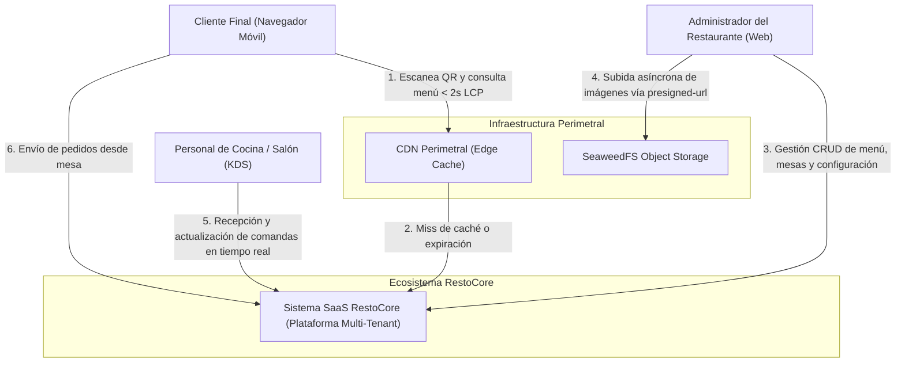

# Modelo C4 - Nivel 1: Diagrama de Contexto del Sistema

Este documento establece el **Diagrama de Contexto (Nivel 1 del Modelo C4)** para el ecosistema RestoCore, ilustrando las fronteras del sistema, los diferentes actores humanos de negocio y sus interacciones con la infraestructura perimetral.

---

## Diagrama de Contexto en Mermaid.js

---

## Descripción de Componentes del Contexto

### 1. Actores Humanos de Negocio
* **Cliente Final (Navegador Móvil):** Usuario anónimo en salón que escanea el código QR de la mesa para acceder a la Carta QR interactiva desde su dispositivo móvil sin requerir instalación de aplicaciones ni registro previo.
* **Administrador del Restaurante (Web):** Usuario autenticado con rol `tenant_admin` que gestiona autónomamente el catálogo gastronómico, precios, modificadores, sectores de salón y mesas físicas.
* **Personal de Cocina / Salón (KDS):** Equipo operativo del restaurante que utiliza pantallas táctiles en cocina (Kitchen Display System) para visualizar comandas entrantes y transicionar sus estados.

### 2. Infraestructura y Almacenamiento
* **CDN Perimetral (Edge Cache):** Red de distribución perimetral responsable de servir las respuestas de la Carta QR pública en menos de 2 segundos (< 2s LCP) desacoplando las lecturas masivas.
* **SeaweedFS Object Storage:** Almacenamiento distribuido de alto rendimiento para guardar y servir las fotografías de los platos y marcas de los restaurantes mediante carga asíncrona.
