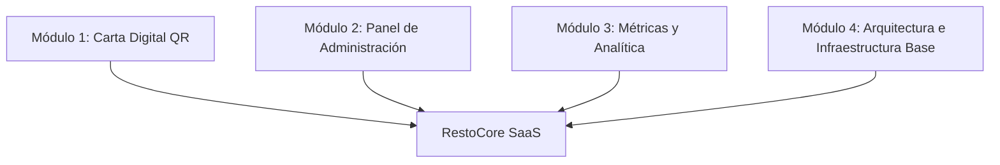

# Visión, Alcance y Requerimientos del Plan Básico MVP

El proyecto **RestoCore (Plan Básico MVP)** es una plataforma SaaS gastronómica multi-tenant diseñada para ofrecer una solución comercializable, ultra-rápida y autónoma para locales gastronómicos. Todas sus especificaciones se desarrollan bajo la metodología **Spec-Driven Development (SDD)** y la filosofía **Docs-as-Code**.

---

## 1. Pilares Fundamentales de la Visión

* **Rendimiento Perimetral (< 2s LCP):** Carga móvil ultra-rápida de la Carta QR digital optimizada mediante almacenamiento en caché CDN y modelos de datos semiflexibles en PostgreSQL (`JSONB`).
* **Autonomía Operativa:** Panel administrativo intuitivo para la gestión completa de menús, categorías, imágenes de alta calidad, personalización de marca e identificadores de mesa.
* **Seguridad y Aislamiento Multi-Tenant:** Garantía inmutable de aislamiento de datos por restaurante mediante autenticación JWT y políticas declarativas OPA/Rego (`ADR-0006`).
* **Trazabilidad Specs-First:** Las especificaciones en este repositorio actúan como la Única Fuente de Verdad (Single Source of Truth) antes de escribir código de aplicación.

---

## 2. Alcance Funcional del Plan Básico MVP

El conjunto mínimo comercializable se organiza en cuatro módulos principales:

---

### Módulo 1: Carta Digital Pública (Menú QR)

Proporciona la interfaz pública de lectura interactiva para clientes desde dispositivos móviles.

* **Identificación por Tenant:** Renderizado dinámico del sitio mediante la ruta relativa `/tenants/{tenant_slug}/menu`.
* **Personalización de Marca (Branding):** Carga dinámica del logotipo, nombre comercial y esquema de colores configurado por el restaurante.
* **Catálogo Interactivo:** Naves de categorías, tarjetas de platos con precios, descripción detallada, alérgenos e imágenes optimizadas en WebP.
* **Filtrado Dinámico:** Ocultamiento en tiempo real de productos o categorías fuera de stock o deshabilitadas.
* **Diseño Adaptativo (Mobile-First):** Interfaz fluida optimizada para pantallas móviles y de escritorio.
* **Acceso mediante QR:** Capacidad de lectura directa tras escanear códigos QR generados por el sistema.

---

### Módulo 2: Panel de Administración SaaS

Herramienta de gestión privada para que los dueños y administradores del local operen su catálogo en tiempo real.

* **Autenticación:** Inicio y cierre de sesión seguro mediante tokens JWT (`BearerAuth`).
* **Dashboard Principal:** Resumen ejecutivo inicial con indicadores clave del establecimiento.
* **Gestión de Menú (CRUD):**
  * **Categorías:** Creación, edición, eliminación y reordenamiento de categorías.
  * **Platos y Modificadores:** Creación y edición de artículos, ajuste de precios, alérgenos y modificadores opcionales.
  * **Control de Visibilidad:** Conmutadores para mostrar u ocultar platos y categorías al instante.
* **Carga Asíncrona de Imágenes:** Generación de URLs pre-firmadas para la subida directa de fotografías a SeaweedFS sin saturar el backend (`ADR-0004`).
* **Configuración del Restaurante & Branding:** Carga de logotipo, selección de paleta cromática e información de contacto.
* **Gestor de Códigos QR:** Módulo para previsualizar, generar y descargar códigos QR listos para imprimir en mesas.

---

### Módulo 3: Métricas y Analítica de Consumo

Información estratégica para que los restaurantes evalúen el comportamiento de sus clientes.

* **Contador de Visitas:** Registro de tráfico e interacciones diarias en la carta digital.
* **Ranking de Platos:** Identificación automatizada de los artículos más vistos y consultados.
* **Tendencias de Tráfico:** Representación gráfica del volumen de clientes por día y franja horaria.

---

### Módulo 4: Arquitectura e Infraestructura Base

Bases técnicas y operacionales para soportar la operación en producción.

* **Persistencia Flex:** Esquemas en PostgreSQL con columnas `JSONB` e índices GIN (`ADR-0003`).
* **API RESTful:** Contratos estabilizados en OpenAPI 3.1 (`specs/openapi.yaml`).
* **Pipeline CI/CD:** Automatización de compilación, ejecución de pruebas estáticas y despliegue a staging/producción.
* **Seguridad Declarativa:** Reglas OPA/Rego en API Gateway para validación de roles (`ADR-0006`).

---

## 3. Criterios de Verificación y Calidad de Lanzamiento

Para considerar el MVP listo para comercialización, se deben cumplir los siguientes escenarios de verificación:

1. **Flujos Críticos:** Verificación automatizada y manual del flujo de autenticación, edición de menú y visualización pública.
2. **Pruebas en Dispositivos Reales:** Validación de la experiencia en navegadores móviles (Safari iOS, Chrome Android).
3. **Presupuesto de Latencia:** Confirmación de respuesta `< 2s LCP` en condiciones de red móvil.
4. **Onboarding:** Guías de usuario e instructivos de configuración para los primeros clientes en producción.
