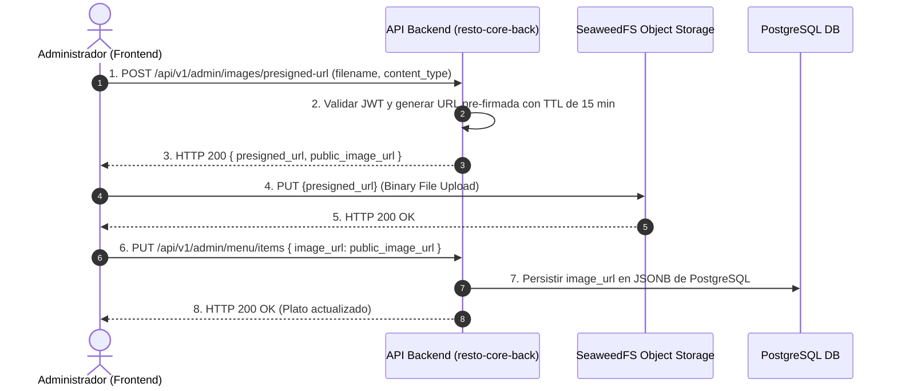

# 0004-carga-asincrona-de-imagenes-seaweedfs

* **Estado:** Proposed
* **Fecha:** 2026-08-17
* **Autores:** Equipo de Arquitectura RestoCore

---

## Contexto y Planteamiento del Problema

Los restaurantes suscritos al sistema RestoCore requieren cargar continuamente imágenes comerciales para sus platos del menú y logos institucionales. La transferencia directa de archivos binarios pesados (formatos JPEG, PNG, WebP) mediante solicitudes HTTP multipart/form-data al servidor de API principal (`resto-core-back`) introduce cuellos de botella severos:

1. **Bloqueo de Hilos I/O:** El procesamiento de transmisiones de archivos multipart consume recursos de CPU y memoria RAM en el servidor de la API principal, reduciendo su capacidad para responder a consultas de lectura críticas.
2. **Degradación de Latencia:** Afecta el presupuesto estricto de rendimiento, donde la visualización del menú público debe completar en menos de 2 segundos (< 2s LCP).
3. **Acoplamiento de Infraestructura:** Obliga al servidor de backend a gestionar almacenamiento persistente de archivos en disco local, complicando el escalado horizontal e instancias sin estado (stateless).

---

## Fuerzas Impulsoras (Decision Drivers)

* **Presupuesto de Latencia (< 2s LCP):** Las operaciones de la API principal deben responder en menos de 500ms y no verse afectadas por transferencias pesadas de archivos.
* **Escalabilidad Stateless:** El servidor de backend debe ser completamente sin estado para permitir autoescalado horizontal en contenedores.
* **Eficiencia de Almacenamiento Distribuido:** Uso de almacenamiento de objetos de alto rendimiento optimizado para archivos pequeños y medianos.
* **Seguridad y Control de Acceso:** Garantizar que solo los administradores autenticados de un Tenant puedan subir imágenes a sus directorios asignados sin exponer claves secretas de almacenamiento en el cliente.

---

## Opciones Consideradas

### Opción 1: Carga Asíncrona Desacoplada mediante URLs Pre-firmadas a SeaweedFS (Seleccionada)
El cliente (Panel de Administración) solicita una URL pre-firmada al backend mediante un endpoint REST ligero. El backend valida el rol del usuario y genera una URL temporal con expiración corta firmada criptográficamente hacia el cluster de **SeaweedFS**. El cliente sube el archivo binario directamente a SeaweedFS desde su navegador, y posteriormente registra la URL resultante en la base de datos PostgreSQL.

* **Ventajas:**
  - El servidor de API principal no procesa ni almacena archivos binarios, manteniendo el consumo de CPU y memoria al mínimo.
  - Transferencia directa de alta velocidad cliente-almacenamiento de objetos.
  - Escalabilidad sin estado perfecta en el backend.
  - Almacenamiento distribuido optimizado con SeaweedFS.
* **Desventajas / Trade-offs:**
  - Requiere un flujo de subida en dos pasos en el cliente Frontend.

### Opción 2: Carga Multipart Directa al Servidor Backend
El cliente envía el archivo binario directamente al servidor API mediante un endpoint multipart `POST /api/v1/admin/images`, y el servidor de API lo retransmite al almacenamiento.

* **Desventajas / Razones de Descarte:**
  - Incumple el Inviolable #4 de `AGENTS.md`.
  - Duplica el tráfico de red y satura la CPU del servidor de backend.
  - Riesgos de denegación de servicio (DoS) por archivos grandes.

### Opción 3: Almacenamiento en Disco Local del Contenedor Backend
Guardar los archivos directamente en el sistema de archivos del servidor API.

* **Desventajas / Razones de Descarte:**
  - Imposibilita el escalado horizontal (instancias stateless).
  - Alto riesgo de pérdida de datos ante reinicios de contenedores.

---

## Decisión Seleccionada

Se selecciona la **Opción 1: Carga Asíncrona Desacoplada mediante URLs Pre-firmadas a SeaweedFS**.

### Flujo de Ejecución Oficial:

---

## Consecuencias

* **Positivas:**
  - El servidor de backend permanece 100% stateless y liviano.
  - Cero impacto en el presupuesto de latencia de la API principal (< 500ms).
  - Integración nativa con SeaweedFS para almacenamiento masivo distribuido.
* **Negativas / Desafíos:**
  - El Frontend (`resto-core-front`) debe implementar la lógica de subida en dos pasos y manejar la expiración del token pre-firmado.

---

## Enlaces y Referencias
* Directrices de Gobernanza: [Guía de Onboarding](../guia-onboarding.md).
* Registro SDD: [ADR-0001](./0001-adopcion-sdd.md).
* Contratos API: [Especificación de API REST](../contrato-api.md).
