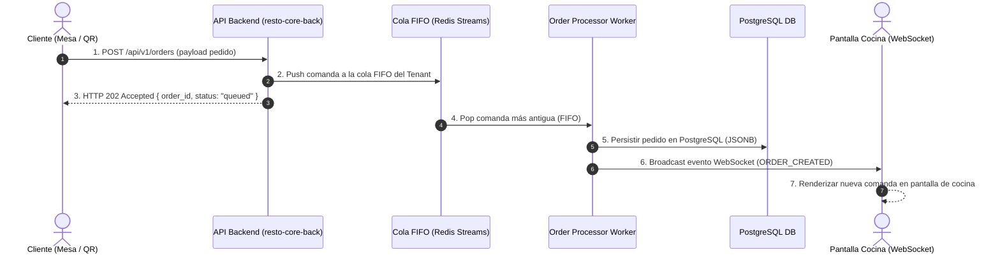

# 0007-procesamiento-pedidos-cola-fifo-websockets

* **Estado:** Proposed
* **Fecha:** 2026-08-17
* **Autores:** Equipo de Arquitectura RestoCore

---

## Contexto y Planteamiento del Problema

En momentos de alta frecuencia de consumo en el restaurante (ejemplo: horarios pico de cena o fines de semana), se generan ráfagas de pedidos simultáneos emitidos desde múltiples mesas del salón.

Procesar las comandas de forma síncrona o desordenada directamente contra la base de datos genera problemas operacionales críticos:
1. **Condiciones de Carrera (Race Conditions):** Múltiples solicitudes concurrentes intentando modificar el stock de platos o la secuencia de comandas pueden causar duplicados o pérdida de pedidos.
2. **Injusticia en el Procesamiento:** Falta de garantización del orden de llegada (First-In, First-Out - FIFO), resultando en que mesas que pidieron más tarde sean atendidas antes que las más antiguas.
3. **Latencia en Cocina:** La cocina requiere recibir notificaciones instantáneas sin refrescar manualmente pantallas o consultar la API repetidamente.

---

## Fuerzas Impulsoras (Decision Drivers)

* **Garantía Estricta FIFO:** Garantizar que el sistema consuma y procese siempre los pedidos en el orden exacto en que fueron recibidos (los más antiguos primero).
* **Prevención de Duplicados y Condiciones de Carrera:** Aislamiento total en la inserción y encolamiento de comandas.
* **Notificación en Tiempo Real (< 100ms):** Comunicación bidireccional inmediata hacia la Pantalla de Cocina (KDS) y los dispositivos del personal de salón.
* **Resiliencia ante Desconexiones:** Capacidad de reconexión automática y sincronización de estado si la conexión de red del salón o cocina se interrumpe temporalmente.

---

## Opciones Consideradas

### Opción 1: Arquitectura Basada en Eventos con Cola FIFO y WebSockets (Seleccionada)
Implementar una cola de mensajes asíncrona con semántica estricta **FIFO** (utilizando Redis Streams o RabbitMQ FIFO queues). Al realizar un pedido desde la mesa, la API valida la solicitud y la encola inmediatamente en la cola del Tenant. Un trabajador consumidor (*worker*) procesa la cola de forma secuencial, persiste el estado en la base de datos PostgreSQL y emite el evento en tiempo real mediante una conexión **WebSocket** persistente (`wss://`) hacia el Kitchen Display System (KDS) de la cocina y el panel de mozos.

* **Ventajas:**
  - Prevención garantizada de condiciones de carrera y comandas duplicadas.
  - Orden estricto FIFO de atención a clientes.
  - Notificaciones en tiempo real con latencia < 100ms sin sobrecargar la API REST.
  - Desacoplamiento total entre la recepción del pedido y su preparación operativa.
* **Desafíos:**
  - El cliente Frontend debe implementar la gestión del ciclo de vida de la conexión WebSocket y la reconexión con exponencial backoff.

### Opción 2: Procesamiento Síncrono Directo a PostgreSQL
Cada pedido realiza una transacción SQL síncrona y la cocina consulta la base de datos periódicamente mediante polling HTTP.

* **Desventajas / Razones de Descarte:**
  - Vulnerable a bloqueos de filas en la base de datos y condiciones de carrera bajo alta concurrencia.
  - El polling HTTP sobrecarga el servidor backend de solicitudes innecesarias.

### Opción 3: Polling Periódico (HTTP Long-Polling) en Cocina
La cocina realiza peticiones HTTP de larga duración cada 2 a 5 segundos para verificar si hay nuevos pedidos.

* **Desventajas / Razones de Descarte:**
  - Introduce retardos artificiales en la recepción de comandas en cocina e incrementa el consumo de recursos de red.

---

## Decisión Seleccionada

Se selecciona la **Opción 1: Arquitectura Basada en Eventos con Cola FIFO y WebSockets**.

### Flujo de Ejecución del Motor de Pedidos:

---

## Consecuencias

* **Positivas:**
  - Garantía inmutable de procesamiento FIFO (los pedidos más viejos siempre se procesan primero).
  - Eliminación total de condiciones de carrera y duplicados en cocina.
  - Notificación inmediata en tiempo real vía WebSockets.
* **Negativas / Desafíos:**
  - Requiere el despliegue del componente de cola (Redis/RabbitMQ) y la gestión de WebSockets en el repositorio de backend.

---

## Enlaces y Referencias
* PRD de Administración: [docs/prd-admin-crud.md](../../clientes/prd-panel-admin.md) (Sección 2 - Nota de Arquitectura Futura).
* Registro de Persistencia: [ADR-0003](./0003-migracion-postgresql.md).
* Registro SDD: [ADR-0001](./0001-adopcion-sdd.md).
