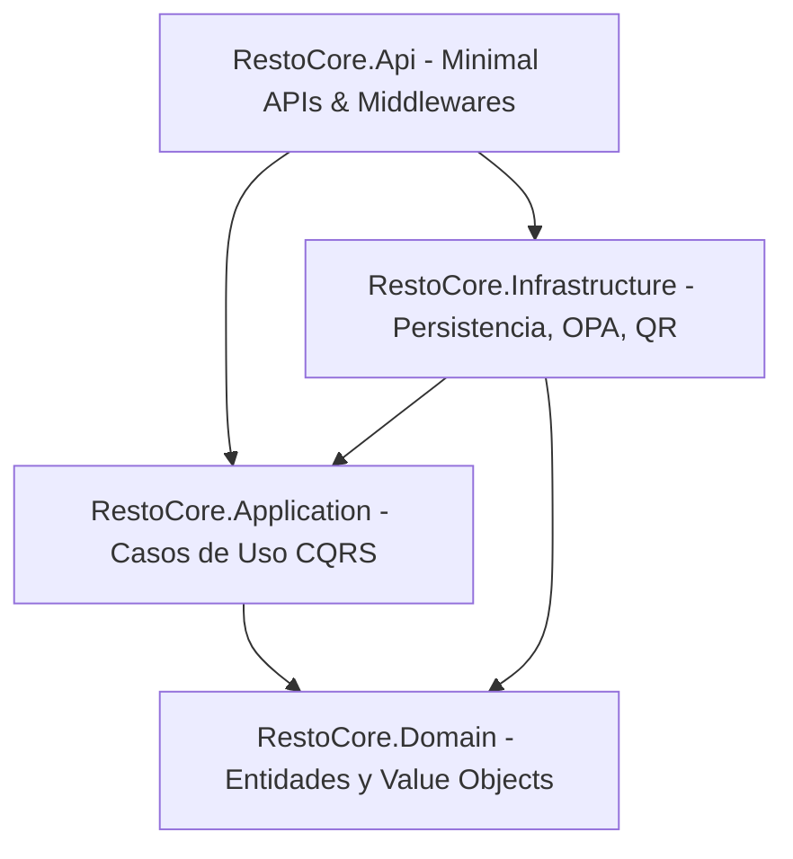

# Arquitectura y Especificación del Backend (.NET 10)

Este documento detalla la arquitectura de software, componentes modulares, modelo de datos y estado de desarrollo del repositorio de backend de la plataforma: **`resto-core-back`**.

---

## 1. Visión General y Stack Tecnológico

El backend de RestoCore es un servicio modular diseñado bajo los principios de **Clean Architecture** (Arquitectura Limpia) y el patrón **CQRS** (Command Query Responsibility Segregation). Proporciona la lógica de negocio, persistencia relacional con capacidades semiestructuradas, resolución multi-tenant y contratos REST para clientes y aplicaciones de administración.

### Stack Tecnológico Base
* **Lenguaje y Runtime:** C# 13 sobre .NET 10 SDK.
* **Framework Web:** ASP.NET Core Minimal APIs con mapeo modular de endpoints.
* **Patrón de Casos de Uso:** MediatR (Mediator Pattern) con separación estricta de Comandos y Consultas.
* **Validación:** FluentValidation integrado en la canalización de comandos.
* **Capa de Persistencia:** Entity Framework Core con el proveedor `Npgsql.EntityFrameworkCore.PostgreSQL`.
* **Motor de Base de Datos:** PostgreSQL 16+ con particionamiento lógico multi-tenant, columnas `JSONB` e índices `GIN` (`ADR-0003`).
* **Seguridad y Autorización:** Autorización declarativa evaluada contra Open Policy Agent (OPA / Rego) (`ADR-0006`).
* **Generación de Códigos QR:** Servicio nativo con exportación vectorial SVG y binaria PNG.
* **Observabilidad:** OpenTelemetry instrumentado para trazado distribuido (W3C Trace Context), métricas y logs estructurados.

---

## 2. Estructura de Capas del Sistema (`src/`)

El código fuente se desacopla en cuatro proyectos con dependencias unidireccionales hacia el núcleo de dominio:

### 2.1. `RestoCore.Domain` (Capa de Dominio)
Contiene las entidades del negocio, invariantes y reglas de dominio puras sin dependencias externas:
* **`Tenant`:** Representa un establecimiento gastronómico. Contiene nombre, slug único, estado activo y el Value Object `BrandingConfig` (logotipo, colores primarios/acento, símbolo monetario, URL de banner).
* **`Category`:** Clasificador de productos en la carta (`ITenantScopedEntity`). Soporta ordenamiento posicional (`SortOrder`) y control de visibilidad (`IsVisible`).
* **`MenuItem`:** Plato o producto comercializable (`ITenantScopedEntity`). Almacena nombre, descripción, precio, imagen, estado de disponibilidad (`IsAvailable`) y etiquetas dietarias (`DietaryTags`) persistidas como colecciones `JSONB`.
* **`ModifierGroup` & `ModifierOption`:** Agrupadores de adicionales y modificaciones (ej. ingredientes extra, puntos de cocción) con reglas de selección mínima y máxima (`MinSelection`, `MaxSelection`) y deltas de precio (`PriceDelta`).
* **`Table`:** Identificador de mesa física en el salón. Contiene número de mesa, sector/zona, token de seguridad criptográfico (`TableToken`) y estado activo.
* **`ITenantScopedEntity`:** Interfaz contractual que garantiza que toda entidad de negocio contenga un `TenantId: Guid` para el particionamiento multi-tenant.

### 2.2. `RestoCore.Application` (Capa de Aplicación)
Implementa los casos de uso del sistema organizados por características funcionales (*Feature Folders*):
* **`Features/PublicMenu`:** Consulta optimizada del menú completo mediante `GetPublicMenuQuery`. Genera la estructura jerárquica de categorías, platos y modificadores, calculando un hash criptográfico `ETag` para soporte de caché HTTP.
* **`Features/Categories`:** Comandos para alta (`CreateCategoryCommand`) y ordenamiento de categorías con validaciones de unicidad de nombre por tenant.
* **`Features/MenuItems`:** Comandos de creación de platos (`CreateMenuItemCommand`) y asignación de grupos de modificadores (`AddModifierGroupCommand`).
* **`Features/Kitchen`:** Comandos operativos inmediatos como la alternancia de disponibilidad (`ToggleItemAvailabilityCommand`) para productos agotados.
* **`Features/QrCodes`:** Consulta y renderizado dinámico de códigos QR para mesas físicas (`GetTableQrQuery`).
* **`Features/Tenants`:** Aprovisionamiento de nuevas cuentas (`ProvisionTenantCommand`) y personalización de marca (`UpdateBrandingCommand`).

### 2.3. `RestoCore.Infrastructure` (Capa de Infraestructura)
Provee la implementación concreta de servicios externos y persistencia:
* **Persistencia (`ApplicationDbContext`):** Implementa Global Query Filters a nivel modelo (`builder.Entity<T>().HasQueryFilter(e => e.TenantId == _tenantContext.CurrentTenantId)`), impidiendo fugas de datos accidentales entre diferentes restaurantes.
* **Mapeo JSONB & GIN:** Configuración explícita de tipos complejos en PostgreSQL (`MenuConfiguration`, `TenantConfiguration`).
* **Middleware Multi-Tenant (`TenantResolutionMiddleware`):** Resuelve el `TenantId` activo de la solicitud evaluando jerárquicamente:
  1. Parámetro de ruta (`{tenant_slug}`).
  2. Cabecera HTTP personalizada `X-Tenant-ID`.
  3. Parámetro de consulta `tenant_id`.
  4. Reclamaciones (claims) del token JWT.
* **Cliente OPA (`OpaClient` & `OpaAuthorizationHandler`):** Transmite el contexto de la solicitud (rol, tenant, recurso, acción) al motor Open Policy Agent y deniega el acceso ante fallos de evaluación.
* **Servicio QR (`QrCodeService`):** Generador de matrices QR vectoriales para garantizar legibilidad en impresiones físicas.
* **Telemetría (`OpenTelemetryExtensions`):** Exportación de métricas y trazas distribuidas con enriquecimiento contextual automático de `tenant.id`.

### 2.4. `RestoCore.Api` (Capa de Presentación y Enrutamiento)
Punto de entrada HTTP estructurado mediante Minimal APIs:
* **Mapeo Modular de Rutas:** Agrupación semántica mediante extensiones de `IEndpointRouteBuilder`.
* **Manejo Centralizado de Excepciones:** `GlobalExceptionHandler` intercepta fallos de validación o del sistema y los transforma al estándar RFC 7807 (Problem Details).
* **Verificación de Salud:** Endpoints `/healthz` (liveness) y `/ready` (readiness con verificación de conexión a PostgreSQL).

---

## 3. Catálogo de Endpoints Implementados

| Módulo / Grupo | Método | Ruta | Autorización | Códigos HTTP | Propósito |
| :--- | :---: | :--- | :---: | :---: | :--- |
| **Menú Público** | `GET` | `/api/v1/tenants/{tenant_slug}/menu` | Público (Anónimo) | 200, 304, 404 | Obtiene la carta completa con `ETag` y `Cache-Control`. |
| **Redirección QR**| `GET` | `/r/{tenant_slug}` | Público (Anónimo) | 302 | Enlace corto para códigos QR impresos. |
| **Catálogo Admin** | `POST` | `/api/v1/admin/categories` | `TenantAdminOnly` | 201, 400, 401, 403 | Alta de categorías para el Tenant activo. |
| **Catálogo Admin** | `POST` | `/api/v1/admin/items` | `TenantAdminOnly` | 201, 400, 401, 403 | Alta de platos con etiquetas dietarias. |
| **Catálogo Admin** | `POST` | `/api/v1/admin/items/{id}/modifiers` | `TenantAdminOnly` | 201, 400, 401, 403 | Agregado de modificadores y opciones de precio. |
| **Catálogo Admin** | `PUT` | `/api/v1/admin/branding` | `TenantAdminOnly` | 200, 401, 403 | Actualización de identidad visual y colores. |
| **Mesas & QR** | `GET` | `/api/v1/admin/tables/{id}/qr` | `TenantAdminOnly` | 200, 401, 403, 404 | Descarga del código QR en formato SVG o PNG. |
| **Cocina (KDS)** | `PATCH` | `/api/v1/kitchen/items/{id}/availability` | `KitchenOnly` | 200, 401, 403, 404 | Cambio inmediato de disponibilidad de stock. |
| **SuperAdmin** | `POST` | `/api/v1/admin/tenants` | `SuperAdminOnly` | 201, 400, 401, 403, 409 | Aprovisionamiento de nuevos restaurantes. |
| **Salud** | `GET` | `/healthz` | Público (Anónimo) | 200 | Estado del proceso del servidor API. |
| **Salud** | `GET` | `/ready` | Público (Anónimo) | 200, 503 | Estado de conectividad con la base de datos PostgreSQL. |

---

## 4. Batería de Pruebas Automatizadas (`tests/`)

El repositorio cuenta con una suite de pruebas automatizadas que certifican la integridad del software:

* **Pruebas Unitarias (`RestoCore.UnitTests`):**
  * `ItemAvailabilityStateTests`: Valida transiciones de disponibilidad en cocina.
  * `MenuValidationTests`: Valida rangos de precios, nombres obligatorios y restricciones de selección en modificadores.
  * `TenantResolutionTests`: Valida la extracción de contexto multi-tenant desde múltiples orígenes.
  * `PublicMenuQueryTests`: Valida la construcción jerárquica de la respuesta pública y la consistencia del hash `ETag`.
  * `QrCodeServiceTests`: Valida la generación correcta de cargas útiles en SVG y PNG.
  * **Resultado de Ejecución:** 18 pruebas superadas con éxito (0 fallos).
* **Pruebas de Integración (`RestoCore.IntegrationTests`):**
  * Implementa `CustomWebApplicationFactory` para pruebas de extremo a extremo en memoria.

---

## 5. Estado de Avance y Próximos Desarrollos

### Funcionalidades Completadas
1. Aislamiento multi-tenant integral a nivel ORM y Middleware.
2. CRUD completo del catálogo gastronómico con modificadores y precios.
3. Generación dinámica de códigos QR con soporte vectorial.
4. Endpoint público de lectura de carta digital con soporte de caché HTTP 304.
5. Control de disponibilidad de stock en tiempo real para el personal de cocina.
6. Aprovisionamiento multi-tenant para SuperAdmin.
7. Migraciones iniciales de PostgreSQL con soporte de colecciones y campos `JSONB`.

### Próximos Hitos Técnicos
* **Carga Asíncrona de Imágenes (`ADR-0004`):** Endpoint para emisión de URLs pre-firmadas hacia SeaweedFS.
* **Motor de Comandas y Cola FIFO (`ADR-0007`):** Integración de Redis Streams y WebSockets seguros (`wss://`) para la recepción de pedidos en tiempo real.
