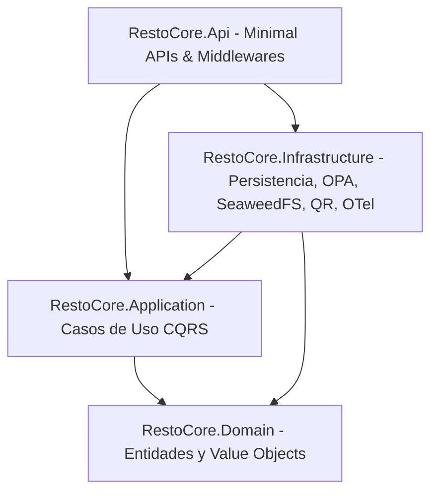

# Arquitectura y Especificación del Backend (.NET 10)

Este documento detalla la arquitectura de software, componentes modulares, modelo de datos, suite de pruebas y estado de desarrollo del repositorio de backend de la plataforma: **`resto-core-back`**.

---

## 1. Visión General y Stack Tecnológico

El backend de RestoCore es un servicio modular diseñado bajo los principios de **Clean Architecture** (Arquitectura Limpia) y el patrón **CQRS** (Command Query Responsibility Segregation). Proporciona la lógica de negocio, persistencia relacional con capacidades semiestructuradas, resolución multi-tenant, contratos REST, almacenamiento de objetos desacoplado y telemetría en tiempo real.

### Stack Tecnológico Base
* **Lenguaje y Runtime:** C# 13 sobre .NET 10 SDK.
* **Framework Web:** ASP.NET Core Minimal APIs con mapeo modular de endpoints.
* **Patrón de Casos de Uso:** Mediador CQRS permisivo de cero dependencias (*Zero-Dependency Mediator* en `RestoCore.Application/Common/Mediator`), desacoplado de bibliotecas externas para maximizar rendimiento y velocidad de resolución.
* **Validación:** FluentValidation integrado en la canalización de comandos de aplicación.
* **Capa de Persistencia:** Entity Framework Core con el proveedor `Npgsql.EntityFrameworkCore.PostgreSQL`.
* **Motor de Base de Datos:** PostgreSQL 16+ con particionamiento lógico multi-tenant, columnas `JSONB` e índices `GIN` (`ADR-0003`).
* **Almacenamiento Desacoplado de Objetos:** SeaweedFS (S3-compatible) mediante generación de URLs pre-firmadas temporales (`ADR-0004`).
* **Seguridad y Autorización:** Autorización declarativa evaluada contra Open Policy Agent (OPA / Rego) (`ADR-0006`).
* **Generación de Códigos QR:** Servicio nativo con exportación vectorial SVG y binaria PNG mediante QRCoder.
* **Observabilidad y Telemetría:** OpenTelemetry instrumentado para trazado distribuido (W3C Trace Context), métricas y logs estructurados OTLP con visualización en tiempo real vía **.NET Aspire Dashboard** (`ADR-0005`, `ADR-0006`).
* **Documentación Interactiva:** Swagger UI / OpenAPI 3.1 integrado para desarrollo local.
* **Validación de Carga y Rendimiento:** Suite automatizada de pruebas de estrés con **k6**.

---

## 2. Estructura de Capas del Sistema (`src/`)

El código fuente se desacopla en cuatro proyectos con dependencias unidireccionales hacia el núcleo de dominio:

### 2.1. `RestoCore.Domain` (Capa de Dominio)
Contiene las entidades del negocio, invariantes y reglas de dominio puras sin dependencias externas:
* **`Tenant`:** Representa un establecimiento gastronómico. Contiene nombre, slug único, estado activo, el Value Object `BrandingConfig` y la propiedad `LayoutConfig?` para la configuración de maquetación visual libre.
* **`LayoutConfig` (Value Object):** Estructura inmutable persistida como `JSONB` que almacena el estado del lienzo (`IsEnabled`), URL de imagen de fondo (`BackgroundUrl`), color hexadecimal de fondo (`BackgroundColor`) y la lista de elementos gráficos (`Elements`).
* **`CanvasElement` (Value Object):** Representa la posición geométrica y capa de un plato o elemento en el lienzo: identificador de plato (`ItemId`), coordenadas relativas (`PosX`, `PosY` entre 0 y 100), dimensiones relativas (`Width`, `Height`), índice de profundidad (`ZIndex`) y estilos adicionales (`CustomStyles`).
* **`MenuPublishJob`:** Entidad de dominio (`ITenantScopedEntity`) que registra y audita las ejecuciones del pipeline asíncrono de compilación Ahead-Of-Time (AOT): identificador único (`Id`), tenant asociado (`TenantId`), estado del trabajo (`Status`: Queued, Processing, Completed, Failed), hash criptográfico generado (`VersionHash`), cantidad de activos procesados (`AssetsProcessed`), duración total en milisegundos (`DurationMs`), mensaje de error (`ErrorMessage`), fecha de inicio (`CreatedAtUtc`) y fecha de finalización (`CompletedAtUtc`).
* **`Category`:** Clasificador de productos en la carta (`ITenantScopedEntity`). Soporta ordenamiento posicional (`SortOrder`) y control de visibilidad (`IsVisible`).
* **`MenuItem`:** Plato o producto comercializable (`ITenantScopedEntity`). Almacena nombre, descripción, precio, imagen, estado de disponibilidad (`IsAvailable`) y etiquetas dietarias (`DietaryTags`) persistidas como colecciones `JSONB`.
* **`ModifierGroup` & `ModifierOption`:** Agrupadores de adicionales y modificaciones con reglas de selección mínima y máxima (`MinSelection`, `MaxSelection`) y deltas de precio (`PriceDelta`).
* **`Table`:** Identificador de mesa física en el salón. Contiene número de mesa, sector/zona, token de seguridad criptográfico (`TableToken`) y estado activo.
* **`ITenantScopedEntity`:** Interfaz contractual que garantiza que toda entidad de negocio contenga un `TenantId: Guid` para el particionamiento multi-tenant obligatorio.

### 2.2. `RestoCore.Application` (Capa de Aplicación)
Implementa los casos de uso del sistema organizados por características funcionales (*Feature Folders*):
* **Mediador Permisivo Zero-Dependency (`Common/Mediator`):** Implementación nativa de `IMediator`, `IRequest<TResponse>`, `IRequestHandler<TRequest, TResponse>` y `ISender`, eliminando la sobrecarga de dependencias de terceros.
* **`Features/PublicMenu`:** Consulta optimizada de la carta digital mediante `GetPublicMenuQuery`. Implementa:
  * **Depuración Automática de Platos Huérfanos (*Orphan Dish Pruning*):** Si un plato posicionado en el lienzo es eliminado del catálogo o marcado como no disponible en cocina, el query omite dicho elemento del árbol geométrico sin corromper el renderizado del lienzo.
  * **Caché y Validación Condicional:** Cabecera HTTP `Cache-Control: public, max-age=3600, s-maxage=86400` y evaluación de `If-None-Match` retornando HTTP 304 Not Modified ante coincidencia de ETag.
* **`Features/MenuLayout`:** Casos de uso de maquetación y compilación de lienzo:
  * **`UpdateMenuLayoutCommand`:** Persiste o deshabilita la disposición geométrica del lienzo libre en la columna `JSONB` del Tenant. Incluye validación exhaustiva con FluentValidation (`UpdateMenuLayoutValidator`) para verificar que las coordenadas y dimensiones relativas se ubiquen en el rango porcentual válido (0 a 100). Sincroniza la invalidación de la clave de caché del menú en Redis.
  * **`PublishMenuCommand`:** Registra un `MenuPublishJob`, inicia el pipeline asíncrono de compilación AOT mediante `IMenuCompilationService`, desencadena la invalidación perimetral a través de `ICdnPurgeService` y retorna HTTP 202 Accepted.
* **`Features/Storage`:** Comando `GeneratePresignedUploadCommand` para la emisión de URLs pre-firmadas hacia SeaweedFS, con validación de extensiones permitidas (`.jpg`, `.jpeg`, `.png`, `.webp`) y límite de tamaño de 5 MB.
* **`Features/Categories`:** Comandos para alta (`CreateCategoryCommand`) y ordenamiento de categorías con validaciones de unicidad de nombre por tenant.
* **`Features/MenuItems`:** Comandos de creación de platos (`CreateMenuItemCommand`) y asignación de grupos de modificadores (`ManageModifiersCommand`).
* **`Features/Kitchen`:** Comandos operativos inmediatos como la alternancia de disponibilidad de stock (`ToggleItemAvailabilityCommand`).
* **`Features/QrCodes`:** Consulta y renderizado dinámico de códigos QR para mesas físicas (`GetTableQrQuery`).
* **`Features/Tenants`:** Aprovisionamiento de nuevas cuentas (`ProvisionTenantCommand`) y personalización de marca (`UpdateBrandingCommand`).

### 2.3. `RestoCore.Infrastructure` (Capa de Infraestructura)
Provee la implementación concreta de servicios externos y persistencia:
* **Persistencia (`ApplicationDbContext`):**
  * Global Query Filters a nivel modelo (`builder.Entity<T>().HasQueryFilter(e => e.TenantId == _tenantContext.CurrentTenantId)`), blindando el aislamiento multi-tenant.
  * Mapeo de `LayoutConfig` como columna `JSONB` en `TenantConfiguration`.
  * Configuración `MenuPublishJobConfiguration` con índices compuestos por `TenantId` y `Status`.
  * Migración EF Core: `20260918025637_AddCanvasLayoutAndMenuPublishJobs`.
  * **Invalidación de Caché Post-Commit:** Detección de mutaciones en entidades del menú durante `SaveChangesAsync()` e invalidación atómica de la caché en memoria y Redis una vez confirmada la transacción en PostgreSQL.
* **Servicio de Compilación AOT (`MenuCompilationService`):** Implementa `IMenuCompilationService` para el preprocesamiento estático del menú, aplanamiento de capas geométricas y cálculo de tiempo de ejecución con SLA inferior a 3 segundos.
* **Servicio de Purgado Perimetral CDN (`LocalDevelopmentCdnPurgeService`):** Implementa `ICdnPurgeService` emitiendo órdenes de invalidación perimetral por tag de tenant. Instrumentado con telemetría OpenTelemetry para registrar fallos con `error.code="CDN_PURGE_FAILURE"`.
* **Almacenamiento Desacoplado (`SeaweedStorageService`):** Implementa `IStorageService` interactuando con la API S3 de SeaweedFS para emitir URLs de subida pre-firmadas temporales.
* **Middleware Multi-Tenant (`TenantResolutionMiddleware`):** Resuelve el `TenantId` activo evaluando jerárquicamente parámetros de ruta, cabecera `X-Tenant-ID`, query param y claims JWT.
* **Cliente OPA (`OpaClient` & `OpaAuthorizationHandler`):** Transmite el contexto de la solicitud al motor Open Policy Agent y deniega el acceso ante fallos de evaluación.
* **Servicio QR (`QrCodeService`):** Generador de matrices QR vectoriales (SVG) y binarias (PNG).
* **Telemetría (`OpenTelemetryExtensions`):** Exportación OTLP hacia el .NET Aspire Dashboard y colectores estándar, enriqueciendo trazas con `tenant.id`.

### 2.4. `RestoCore.Api` (Capa de Presentación y Enrutamiento)
Punto de entrada HTTP estructurado mediante Minimal APIs:
* **Mapeo Modular de Rutas:** Agrupación semántica (`PublicMenuEndpoints`, `AdminMenuLayoutEndpoints`, `AdminCatalogEndpoints`, `AdminTableEndpoints`, `AdminTenantEndpoints`, `KitchenEndpoints`, `StorageEndpoints`, `HealthEndpoints`).
* **Soporte de Caché Condicional y Distribución Perimetral:** Implementación de cabeceras HTTP `ETag` y `Cache-Control: public, max-age=3600, s-maxage=86400` con retorno HTTP 304 Not Modified ante coincidencias de `If-None-Match`.
* **Manejo Centralizado de Excepciones:** `GlobalExceptionHandler` intercepta fallos y genera respuestas estándar RFC 7807 (Problem Details) con trazabilidad `traceId`.
* **Verificación de Salud Exhaustiva:** Endpoints `/healthz` (liveness) y `/ready` (readiness con auditoría concurrente de PostgreSQL, Redis, SeaweedFS y OPA).

---

## 3. Catálogo Completo de Endpoints Implementados

| Módulo / Grupo | Método | Ruta | Autorización | Códigos HTTP | Propósito |
| :--- | :---: | :--- | :---: | :---: | :--- |
| **Menú Público** | `GET` | `/api/v1/tenants/{tenant_slug}/menu` | Público (Anónimo) | 200, 304, 404 | Obtiene la carta completa con `layout_config`, poda de huérfanos, `ETag` y `Cache-Control`. |
| **Redirección QR**| `GET` | `/r/{tenant_slug}` | Público (Anónimo) | 302 | Enlace corto para códigos QR impresos. |
| **Lienzo Admin** | `PUT` | `/api/v1/admin/menu/layout` | `TenantAdminOnly` | 200, 400, 401, 403, 404 | Guarda o restablece la configuración geométrica de lienzo en JSONB (`ADR-0008`). |
| **Compilación Admin**| `POST`| `/api/v1/admin/menu/publish` | `TenantAdminOnly` | 202, 401, 403, 422, 500 | Desencadena pipeline AOT y purgado perimetral CDN con SLA < 3s (`ADR-0006`). |
| **Almacenamiento** | `POST` | `/api/v1/storage/presigned-upload` | `TenantAdminOnly` | 200, 400, 401, 403 | Genera URL pre-firmada temporal hacia SeaweedFS (`ADR-0004`). |
| **Catálogo Admin** | `POST` | `/api/v1/admin/categories` | `TenantAdminOnly` | 201, 400, 401, 403 | Alta de categorías para el Tenant activo. |
| **Catálogo Admin** | `POST` | `/api/v1/admin/items` | `TenantAdminOnly` | 201, 400, 401, 403 | Alta de platos con etiquetas dietarias JSONB. |
| **Catálogo Admin** | `POST` | `/api/v1/admin/items/{id}/modifiers` | `TenantAdminOnly` | 201, 400, 401, 403 | Agregado de modificadores y opciones de precio. |
| **Catálogo Admin** | `PUT` | `/api/v1/admin/branding` | `TenantAdminOnly` | 200, 401, 403 | Actualización de identidad visual y colores. |
| **Mesas & QR** | `GET` | `/api/v1/admin/tables/{id}/qr` | `TenantAdminOnly` | 200, 401, 403, 404 | Descarga del código QR en formato SVG o PNG. |
| **Cocina (KDS)** | `PATCH` | `/api/v1/kitchen/items/{id}/availability` | `KitchenOnly` | 200, 401, 403, 404 | Cambio inmediato de disponibilidad de stock. |
| **SuperAdmin** | `POST` | `/api/v1/admin/tenants` | `SuperAdminOnly` | 201, 400, 401, 403, 409 | Aprovisionamiento de nuevos restaurantes. |
| **Salud** | `GET` | `/healthz` | Público (Anónimo) | 200 | Estado de vida del proceso del servidor. |
| **Salud** | `GET` | `/ready` | Público (Anónimo) | 200, 503 | Estado de conectividad de PostgreSQL, Redis, SeaweedFS y OPA. |

---

## 4. Infraestructura Local y Observabilidad (`docker-compose.dev.yml`)

El entorno de desarrollo local orquesta todos los servicios requeridos de manera hermética:
* **PostgreSQL 16 Alpine:** Base de datos relacional multi-tenant (puerto `5432`).
* **Redis 7 Alpine:** Motor de caché y mensajería (puerto `6379`).
* **SeaweedFS:** Almacenamiento de objetos S3 desacoplado (puertos `8333`, `9000`, `9333`).
* **Open Policy Agent (OPA):** Motor de autorización declarativa con montaje de reglas Rego (puerto `8181`).
* **.NET Aspire Dashboard (`mcr.microsoft.com/dotnet/aspire-dashboard`):** Panel interactivo OTLP para visualización de trazas, métricas y logs estructurados correlacionados en tiempo real (puerto `18888` para UI web y `4317` para gRPC OTLP).

---

## 5. Batería de Pruebas Automatizadas (`tests/`)

El backend cuenta con una batería de pruebas automatizadas organizadas en tres proyectos de validación:

### 5.1. Pruebas Unitarias (`RestoCore.UnitTests`) - 30 Tests Superados
* `ItemAvailabilityStateTests`: Valida transiciones de disponibilidad en cocina.
* `MenuValidationTests`: Valida rangos de precios, nombres obligatorios y restricciones de selección en modificadores.
* `TenantResolutionTests`: Valida la extracción de contexto multi-tenant desde múltiples orígenes.
* `PublicMenuQueryTests` & `PublicMenuCanvasTests`: Valida la construcción jerárquica de la respuesta pública, consistencia del hash `ETag`, renderizado de coordenadas relativas de lienzo y depuración transparente de platos huérfanos.
* `QrCodeServiceTests`: Valida la generación correcta de matrices QR en SVG y PNG.
* `UpdateMenuLayoutValidatorTests`: Valida reglas geométricas estrictas (rango porcentual de coordenadas entre 0 y 100, dimensiones mayores a cero, índice `z-index` no negativo y formato de URI para fondos).
* `MenuCompilationServiceTests`: Valida la compilación AOT de estructuras planas, aplanamiento de capas y cumplimiento del SLA de ejecución (< 3 segundos).

### 5.2. Pruebas de Integración (`RestoCore.IntegrationTests`)
* `AdminMenuLayoutEndpointsTests`: Valida la mutación protegida del lienzo (`PUT /api/v1/admin/menu/layout`), denegación por roles no autorizados y validación 400 ante geometrías inválidas.
* `MenuPublishEndpointsTests`: Valida el endpoint `POST /api/v1/admin/menu/publish`, el encolamiento y retorno 202 Accepted, la creación de registros `MenuPublishJob` y la invalidación perimetral.
* `PublicMenuCanvasEndpointsTests`: Valida la consulta de la carta pública con soporte dual (plantilla base y modo lienzo), evaluación condicional 304 ETag y preservación de resiliencia.
* `ContainerReadinessTests`: Verifica la conectividad y respuesta saludable de dependencias externas (PostgreSQL, Redis, SeaweedFS, OPA).
* `SeaweedStorageTests`: Verifica la generación y expiración de URLs pre-firmadas hacia el gateway S3.
* `SwaggerEndpointTests`: Verifica la disponibilidad de Swagger UI en desarrollo y su restricción en producción.
* `AspireDashboardReadinessTests`: Valida la conectividad con el colector OTLP del Aspire Dashboard.
* `FullLifecycleE2ETests`: Flujo completo E2E de aprovisionamiento de tenant, creación de platos, emisión de QR y consulta pública con ETag.

### 5.3. Pruebas de Seguridad (`RestoCore.SecurityTests`)
* `CrossTenantDatabaseIsolationTests`: Valida que los filtros de consulta globales impidan de forma estricta cualquier fuga o lectura de datos entre diferentes tenants.

---

## 6. Pruebas de Carga y Rendimiento con k6 (`scripts/k6/`)

Se implementó una suite de pruebas de estrés automatizada mediante scripts de k6 (`scripts/run-stress-tests.ps1`):
* **`public-menu-load.js`:** Carga sostenida sobre el endpoint público de la carta.
* **`public-menu-stress.js`:** Estrés concurrente para auditar el presupuesto de latencia (< 500ms p95 bajo carga).
* **`etag-cache-test.js`:** Validación de respuestas 304 Not Modified con cabeceras `If-None-Match`, certificando latencias < 50ms al operar bajo caché.
* **`all-endpoints-test.js`:** Prueba integral sobre endpoints de catálogo, cocina, almacenamiento y mesas.
