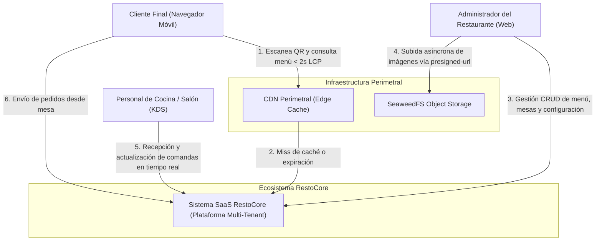

# Diagramado de Arquitectura (Modelo C4 en Mermaid.js)

Este documento contiene la representación gráfica y la especificación del **Modelo C4 (Contexto y Contenedores)** para el ecosistema RestoCore.

---

## Nivel 1: Diagrama de Contexto del Sistema

El Diagrama de Contexto ilustra los límites del sistema RestoCore y las interacciones con los distintos actores de negocio.



---

## Nivel 2: Diagrama de Contenedores del Sistema

El Diagrama de Contenedores detalla las aplicaciones ejecutables, servicios backend, almacenes de datos y protocolos de comunicación acorde a los registros ADRs aceptados (`ADR-0001` a `ADR-0007`).

```mermaid
graph TD
    subgraph Capa de Presentación (Frontend SaaS)
        FrontWeb["Frontend SaaS Web/Mobile (resto-core-front)"]
    end

    subgraph Capa Perimetral y Almacenamiento Estático
        CDN["CDN Perimetral (Edge Cache) [ADR-0005]"]
        SeaweedFS[("SeaweedFS Storage [ADR-0004]")]
    end

    subgraph Capa de Servicios Backend (resto-core-back)
        API["API REST Backend (resto-core-back) [ADR-0001]"]
        OPAMotor["OPA Engine (Rego Policies) [ADR-0006]"]
        WSServer["WebSocket Gateway [ADR-0007]"]
        OrderWorker["Order Processor Worker [ADR-0007]"]
    end

    subgraph Capa de Persistencia y Mensajería
        PostgreSQL[("PostgreSQL DB (JSONB + GIN) [ADR-0003]")]
        RedisQueue[("Redis Streams (Cola FIFO) [ADR-0007]")]
    end

    FrontWeb -->|HTTP GET Menu < 2s LCP| CDN
    CDN -->|Miss Cache / Fetch| API
    FrontWeb -->|HTTP REST + JWT| API
    API -->|Validar Rego AuthZ| OPAMotor
    API -->|Pre-signed URL Token| FrontWeb
    FrontWeb -->|PUT Direct Binary Upload| SeaweedFS
    
    FrontWeb -->|POST /api/v1/orders| API
    API -->|Push Comanda FIFO| RedisQueue
    RedisQueue -->|Pop Sequenced Order| OrderWorker
    OrderWorker -->|Persistir JSONB Order| PostgreSQL
    API -->|SELECT / UPDATE JSONB| PostgreSQL
    OrderWorker -->|Broadcast ORDER_CREATED| WSServer
    WSServer -->|WebSocket Real-time < 100ms| FrontWeb
```
