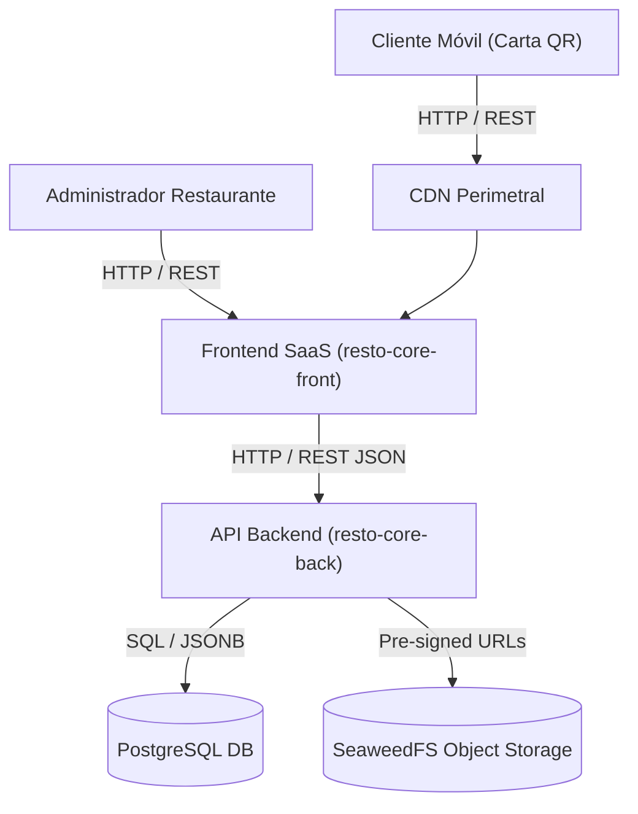

# Diagramado de Arquitectura (Modelo C4 en Mermaid.js)

Modelado de contenedores del sistema RestoCore.

---

## Nivel 2: Diagrama de Contenedores

```mermaid
graph TD
    User["Cliente Móvil (Carta QR)"] -->|HTTP / REST| CDN["CDN Perimetral"]
    Admin["Administrador Restaurante"] -->|HTTP / REST| Front["Frontend SaaS (resto-core-front)"]
    CDN --> Front
    Front -->|HTTP / REST JSON| Back["API Backend (resto-core-back)"]
    Back -->|SQL / JSONB| DB[("PostgreSQL DB")]
    Back -->|Pre-signed URLs| S3[("SeaweedFS Object Storage")]
```
