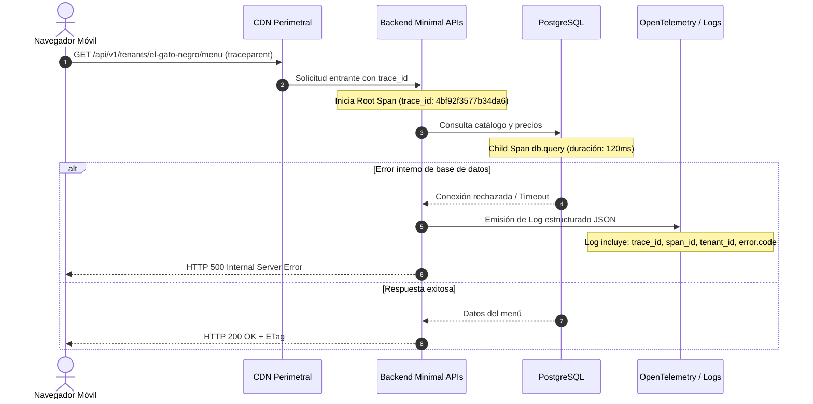

# Observabilidad y Telemetría: Logs, Trazas y Correlación

Este documento establece las definiciones formales, estándares de instrumentación y políticas operativas de **Observabilidad y Telemetría** para la plataforma RestoCore bajo el estándar **OpenTelemetry (OTel)**.

---

## 1. Definición Formal de Logs

Los logs representan eventos discretos e independientes ocurridos en un punto específico en el tiempo. Su propósito fundamental es responder a la interrogante:
> **¿Qué sucedió exactamente y con qué contexto en un instante dado?**

### Contenido Clave
* Mensajes de excepción no controlada y trazas de error en pila (*stack traces*).
* Parámetros relevantes de entrada y salida en solicitudes HTTP (`GET`, `POST`, `PUT`, `PATCH`, `DELETE`).
* Transiciones y cambios de estado en entidades de negocio (ejemplo: alta de categorías, actualización de disponibilidad en cocina).
* Fallos de validación de esquemas y reglas de dominio.

### Estructura Obligatoria
Los logs deben emitirse obligatoriamente en **formato estructurado (JSON)** para permitir su indexación y consulta mediante motores de agregación (como Grafana Loki, Elasticsearch o AWS CloudWatch). Todo log debe incluir atributos estandarizados:
* `timestamp`: Fecha y hora precisa en formato ISO 8601 UTC.
* `level`: Severidad (`Debug`, `Information`, `Warning`, `Error`, `Fatal`).
* `tenant_id`: Identificador único del restaurante afectado.
* `http.status_code`: Código de respuesta HTTP devuelto al cliente.
* `error.code`: Identificador unívoco del error de negocio (ejemplo: `TENANT_INACTIVE`, `ITEM_NOT_FOUND`).
* `user.id`: Identificador del usuario autenticado (si aplica).

### Casos de Uso
* Análisis de causa raíz (RCA - *Root Cause Analysis*) tras un fallo crítico.
* Diagnóstico forense de excepciones inesperadas en producción.
* Auditoría de eventos sensibles de administración y catálogo.

---

## 2. Definición Formal de Trazas (Traces)

Las trazas representan el recorrido completo (*lifecycle*) y distribuido que realiza una solicitud a través de los diferentes componentes y límites de red del sistema. Su propósito fundamental es responder a la interrogante:
> **¿Por dónde pasó la solicitud y cuánto tiempo tomó cada etapa?**

### Contenido Clave
Una traza se compone de unidades de trabajo jerárquicas delimitadas denominadas **spans**. Cada span registra:
* Nombre de la operación (`operationName`).
* Marca temporal de inicio y fin.
* Duración acumulada de la etapa.
* Servicio ejecutor (`service.name`).
* Atributos contextuales de infraestructura (ejemplo: `db.system: postgresql`, `http.method: GET`).
* Estado y resultado final de la operación (`StatusCode: Ok | Error`).

### Casos de Uso
* Medición rigurosa de presupuestos de latencia (ejemplo: auditar el SLA de la Carta QR pública en < 2 segundos LCP y < 500ms p95 en backend).
* Detección de cuellos de botella y degradación de rendimiento en consultas a PostgreSQL (ej. falta de índices GIN en columnas JSONB).
* Monitoreo de tiempos de transferencia hacia almacenamiento de objetos (SeaweedFS).
* Análisis de concurrencia y dependencias distribuidas.

---

## 3. Matriz Comparativa: Logs vs. Trazas

| Dimensión | Logs Estructurados | Trazas Distribuidas (Traces) |
| :--- | :--- | :--- |
| **Pregunta Central** | ¿Qué ocurrió exactamente en este momento? | ¿Por dónde viajó la petición y cuánto tardó? |
| **Modelo de Datos** | Evento discreto e independiente (JSON). | Grafo acíclico dirigido de intervalos (*spans*). |
| **Dimensión Temporal** | Marca de tiempo puntual (*point-in-time*). | Rango de tiempo delimitado (duración acumulada). |
| **Métrica Principal** | Contexto del error, stack trace, estado. | Latencia (p50, p95, p99), cuellos de botella. |
| **Costo de Ingesta** | Lineal con la cantidad de eventos registrados. | Controlable mediante estrategias de muestreo (*sampling*). |
| **Destino Principal** | Análisis de causa raíz (RCA) y auditoría. | Monitoreo de rendimiento (APM) y SLAs. |

---

## 4. El Vínculo Crucial: Correlación de Telemetría

Para que la separación entre logs y trazas funcione de manera óptima en producción, se exige la **correlación bidireccional estricta** basada en los estándares del **W3C Trace Context** y **OpenTelemetry**:

### Regla de Correlación Obligatoria
1. Cuando un trace detecta que el endpoint `GET /api/v1/tenants/el-gato-negro/menu` experimentó una latencia anómala (ej. 3.5 segundos) o devolvió un código HTTP 500, el sistema registra un span fallido con su respectivo `trace_id` y `span_id`.
2. El log estructurado generado durante esa misma solicitud **debe incluir indefectiblemente el `trace_id` y el `span_id`**.
3. Esto permite que el ingeniero de operaciones o soporte salte directamente desde la gráfica de rendimiento (traza en Jaeger) al log exacto que contiene el mensaje de excepción o payload causante del incidente.

---

## 5. Políticas Obligatorias de Registro

### 5.1. Regla Anti-Redundancia
* **Prohibición de Logs de Inicio y Fin:** Queda terminantemente prohibido registrar logs estructurados con mensajes informativos tales como *"Iniciando método GetPublicMenu"* o *"Finalizando método GetPublicMenu"*.
* **Delegación a Trazas:** La medición de tiempos de inicio, fin y duración se delega de forma exclusiva a la instrumentación de `spans` de OpenTelemetry. Los logs deben reservarse para transiciones de estado y excepciones reales.

### 5.2. Protección de Datos Sensibles (Privacidad y PII)
* Queda prohibido registrar en logs contraseñas, tokens JWT en texto plano, datos de tarjetas de crédito o información de contacto personal de clientes comensales.
* Los identificadores de tenant (`tenant_id`), mesa (`table_id`) y códigos de error son los atributos primarios recomendados para la indexación.

---

## 6. Integración en el Ciclo SDD (Docs-as-Code)

La observabilidad se formaliza en los artefactos del ciclo de vida del software:
* **En los PRDs (Dimensión 3 - Restricciones y Asunciones):** Se define qué trazas auditarán el presupuesto de latencia de la Carta QR (< 2s LCP) y qué logs capturarán las excepciones sin exponer datos personales sensibles.
* **En los Runbooks Operativos (`docs/runbooks/`):** Se detallan los filtros de búsqueda basados en atributos estructurados para acelerar la resolución de incidentes (`diagnostico-observabilidad-incidentes.md`).
* **En la Gobernanza de Ingeniería (`AGENTS.md`):** Se establecen los límites inviolables de correlación OTel y prohibición de logs redundantes.
