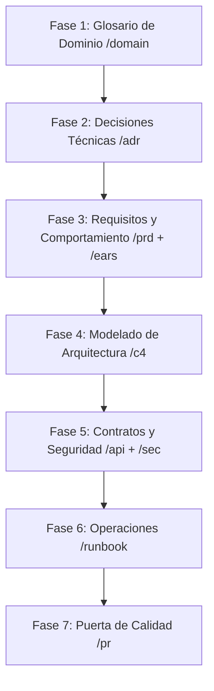

# Flujo de Trabajo Homologado: Desarrollo Guiado por Especificaciones (SDD)

Este documento establece el ciclo de vida oficial y el flujo de trabajo secuencial para el diseño, especificación, validación e integración de software dentro del repositorio de especificaciones (`menu-specs`). Su propósito es servir como la base de conocimiento definitiva para que el agente de inteligencia artificial (Antigravity) guíe de manera activa y consultiva al equipo de desarrollo, asegurando que la documentación actúe como la única fuente de verdad (Single Source of Truth) antes de escribir código de aplicación.

---

## 1. Principios Operativos del Workflow

### Docs-as-Code y Spec-Driven Development (SDD)
Toda especificación funcional, de comportamiento, contrato de interfaz y decisión de arquitectura se trata con el mismo rigor que el código fuente. Se escribe en formatos estructurados (Markdown, YAML, Rego, diagramas Mermaid) y se gestiona exclusivamente a través de un sistema de control de versiones (Git).

### Revelación Progresiva y Diálogo Interactivo
El agente no debe redactar especificaciones definitivas de manera unilateral o presuntiva en su primera interacción. Su rol es actuar como un consultor técnico que:
1. Analiza el estado actual del repositorio.
2. Sugiere prioridades metodológicas sobre qué secciones definir primero.
3. Realiza preguntas estructuradas al desarrollador para obtener la información del negocio de manera incremental.
4. Audita activamente las propuestas frente a las restricciones de arquitectura preestablecidas.

---

## 2. Las 7 Fases del Ciclo de Vida del Diseño Técnico

Para cada nueva funcionalidad, módulo o cambio estructural, el equipo y el agente deben avanzar de manera ordenada a través de las siguientes fases secuenciales utilizando los comandos de barra (`/`) correspondientes.

---

### Fase 1: Alineación del Dominio y Lenguaje Ubicuo
El objetivo es erradicar la ambigüedad lingüística antes de definir cualquier regla de negocio o interfaz técnica, garantizando un vocabulario común entre el equipo de ingeniería y el agente.

*   **Comando del agente:** `/domain`
*   **Ubicación en repositorio:** `docs/domain-glossary.md`
*   **Acciones obligatorias:**
    *   Definir y documentar de manera formal los conceptos clave del negocio (por ejemplo: "Tenant", "Carta QR", "Plato", "Categoría Oculta").
    *   Asociar cada término con su representación conceptual en las estructuras de datos.
*   **Instrucciones del agente para el inicio:** Si se invoca el comando, el agente identificará si el término ya existe en el glosario. De no existir, solicitará su definición técnica y el contexto de su uso antes de incorporarlo.

---

### Fase 2: Registro de Decisiones de Arquitectura (ADR)
Cualquier cambio estructural, de infraestructura o de selección de tecnologías debe formalizarse y justificarse técnicamente antes de proceder con el diseño funcional.

*   **Comando del agente:** `/adr`
*   **Ubicación en repositorio:** `docs/adr/`
*   **Herramienta integrada:** CLI de `dotnet-adr` (ejecutada mediante el comando `adr`).
*   **Estructura obligatoria (MADR):**
    1.  **Title:** Identificador secuencial de tres dígitos y nombre (ej. `0003-migracion-postgresql.md`).
    2.  **Status:** Proposed, Accepted, Rejected, Deprecated o Superseded.
    3.  **Context:** Fuerzas del diseño, restricciones y motivación técnica del cambio.
    4.  **Decision:** Alternativa seleccionada y justificación objetiva.
    5.  **Alternatives:** Opciones evaluadas con sus respectivas ventajas y desventajas.
    6.  **Consequences:** Impacto técnico resultante (positivo y negativo).
*   **Instrucciones del agente para el inicio:** El agente debe exigir que los ADR se aíslen inmediatamente de los requerimientos funcionales y se envíen a través de una rama de arquitectura separada (`arch/adr-XXXX`) mediante el comando `/pr` para fijar las restricciones en la rama principal.

---

### Fase 3: Especificación de Requisitos y Comportamiento del Producto
Definición de qué debe hacer el sistema desde la perspectiva del producto, estructurando el comportamiento de manera medible y sin ambigüedades.

*   **Comandos del agente:** `/prd` y `/ears`
*   **Ubicación en repositorio:** `docs/`
*   **Estructura del PRD (6 Dimensiones de SDD):**
    1.  **Resultados (Outcomes):** Valor de negocio y estados finales esperados.
    2.  **Límites de Alcance:** Fronteras explícitas del desarrollo (*In-Scope* y *Out-of-Scope*).
    3.  **Restricciones:** Límites técnicos duros, presupuestos de latencia e infraestructura.
    4.  **Decisiones Previas:** Referencias directas a los ADRs vigentes en el repositorio.
    5.  **Desglose de Tareas Atómicas:** Separación estricta de tareas independientes para Frontend y Backend.
    6.  **Criterios de Verificación:** Reglas del sistema en sintaxis EARS y escenarios en formato Gherkin (`Given-When-Then`).
*   **Sintaxis EARS Obligatoria (Los 5 Patrones):**
    *   *Ubiquitous:* `El [sistema] DEBERÁ [respuesta]`.
    *   *Event-Driven:* `CUANDO [disparador], el [sistema] DEBERÁ [respuesta]`.
    *   *State-Driven:* `MIENTRAS [estado], el [sistema] DEBERÁ [respuesta]`.
    *   *Unwanted Behavior:* `SI [condición de error], ENTONCES el [sistema] DEBERÁ [respuesta]`.
    *   *Optional Features:* `DONDE [funcionalidad habilitada], el [sistema] DEBERÁ [respuesta]`.
*   **Instrucciones del agente para el inicio:**
    *   En `/prd`, el agente recomendará iniciar delimitando los límites del alcance para proteger el esfuerzo del equipo.
    *   En `/ears`, el agente recomendará definir primero el comportamiento constante (*Ubiquitous*) y el camino de éxito (*Event-Driven*) antes de abordar las excepciones (*Unwanted Behavior*). Bloqueará el uso de adjetivos subjetivos (ej. "rápido", "seguro").

---

### Fase 4: Modelado de Arquitectura Lógica (Diagramas C4)
Visualización estructurada de los componentes lógicos del sistema y sus interacciones físicas antes de la codificación.

*   **Comando del agente:** `/c4`
*   **Ubicación en repositorio:** `diagrams/`
*   **Herramienta de diagramado:** Código plano interpretable por Mermaid.js.
*   **Niveles obligatorios:**
    *   **Nivel 1 (Contexto):** Muestra el sistema en relación con los usuarios finales (clientes, dueños de restaurantes) y sistemas externos.
    *   **Nivel 2 (Contenedores):** Detalla las aplicaciones ejecutables (SaaS Frontend, API Backend, base de datos PostgreSQL, almacenamiento SeaweedFS) y sus protocolos de comunicación (HTTP/REST, TCP).
*   **Instrucciones del agente para el inicio:** El agente propondrá un esqueleto inicial de Mermaid.js basado en las restricciones del archivo `AGENTS.md` y solicitará la validación de las interacciones lógicas del flujo propuesto.

---

### Fase 5: Contratos de Datos y Seguridad (API-First & Security-as-Code)
Definición de las interfaces técnicas estables que desvinculan el desarrollo y el control de accesos declarativo.

*   **Comandos del agente:** `/api` y `/sec`
*   **Ubicación en repositorio:** `specs/openapi.yaml` (OpenAPI 3.1) y `specs/policies/` (lenguaje Rego para OPA).
*   **Restricciones de API del Proyecto (AGENTS.md):**
    *   Protocolo estrictamente **REST API**. Queda descartado GraphQL.
    *   Esquemas JSON flexibles y adaptables para PostgreSQL (JSONB).
    *   El almacenamiento de imágenes se realiza mediante flujos asíncronos: el cliente solicita una URL pre-firmada mediante `POST` al Backend, sube el archivo directamente a SeaweedFS, y guarda la URL resultante en la base de datos. Se prohíbe definir endpoints de carga multipart directos al servidor de API.
*   **Instrucciones del agente para el inicio:**
    *   En `/api`, el agente recomendará diseñar primero el endpoint de lectura pública principal (ej. `GET /api/v1/tenants/{tenant_slug}/menu`) para proporcionar datos simulados (mocks) que permitan avanzar al Frontend sin bloqueos.
    *   En `/sec`, el agente guiará en la definición matemática de las reglas de autorización Rego según los roles identificados en el dominio.

---

### Fase 6: Runbooks Operacionales Ejecutables
La documentación técnica del ciclo de vida debe incluir las instrucciones operativas precisas para el despliegue, configuración de infraestructura e instrumentación de la observabilidad.

*   **Comando del agente:** `/runbook`
*   **Ubicación en repositorio:** `docs/runbooks/`
*   **Formato:** Markdown interactivo ejecutable compatible con Runme.dev.
*   **Contenido:** Integración de bloques de documentación explicativa con scripts ejecutables en consola (ej. inicialización de esquemas en PostgreSQL, pruebas de integración de API, configuración de variables de entorno, o trazas de OpenTelemetry).
*   **Instrucciones del agente para el inicio:** El agente sugerirá las secciones operativas mínimas basándose en la tecnología afectada y proporcionará los comandos base para que el desarrollador interactúe directamente desde su consola de documentación.

---

### Fase 7: Puerta de Calidad e Integración (Spec Gate)
Consolidación de los cambios en una propuesta de integración formal, garantizando la consistencia interna de la especificación antes de que se comience a programar la funcionalidad.

*   **Comando del agente:** `/pr`
*   **Mecanismo operativo:** Análisis estático de consistencia (Self-Review Gate).
*   **Validaciones obligatorias antes de generar el PR:**
    *   Que no existan violaciones arquitectónicas en `specs/openapi.yaml` (no GraphQL, uso correcto de SeaweedFS).
    *   Que cada requerimiento en EARS no presente términos ambiguos.
    *   Que los ADRs sigan la nomenclatura numérica y estructural estipulada.
*   **Estrategia de Aislamiento Inteligente (Mandatoria):**
    *   **Si se detectan cambios en `/doc/adr/`:** El agente detendrá el empaquetado conjunto de especificaciones. Obligará al usuario a crear un Pull Request aislado y dedicado exclusivamente a la decisión de arquitectura bajo el prefijo `arch: [ADR-XXXX] Nombre de la decisión`. Esto asegura que el debate estructural sea independiente y prioritario.
    *   **Si se detectan cambios en `/docs/` o `/specs/`:** Agrupará de manera cohesionada el PRD, las cláusulas EARS, el contrato OpenAPI y los diagramas C4 en un único Pull Request de funcionalidad bajo el prefijo `feature: [Módulo] Nombre del Flujo`. Esto garantiza que el contrato funcional viaje completo y sin inconsistencias.
*   **Entregables de la ejecución `/pr`:**
    *   **Descripción del PR en Markdown:** Con alineación de restricciones y un desglose atómico e independiente de tareas técnicas que el Frontend (vistas, componentes, datos simulados) y el Backend (lógica, rutas, validaciones de persistencia) implementarán de forma paralela y sin bloqueos.
    *   **Instrucciones de Git:** Líneas de comando exactas para que el desarrollador cree la rama correspondiente en la terminal, registre la versión y envíe el contenido al servidor remoto para la revisión humana.
