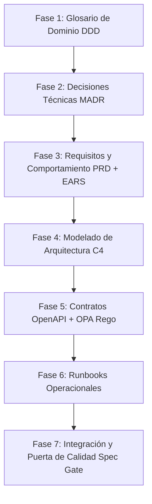

# Flujo de Trabajo Homologado: Desarrollo Guiado por Especificaciones (SDD)

Este documento establece el ciclo de vida oficial y el flujo de trabajo secuencial para el diseño, especificación, validación e integración de software dentro del repositorio de especificaciones de **RestoCore**. Su propósito es servir como la guía metodológica definitiva para el equipo de desarrollo, asegurando que la documentación actúe como la Única Fuente de Verdad (Single Source of Truth) antes de escribir código de aplicación.

---

## 1. Principios Operativos del Workflow

### Docs-as-Code y Spec-Driven Development (SDD)
Toda especificación funcional, de comportamiento, contrato de interfaz y decisión de arquitectura se trata con el mismo rigor que el código fuente. Se escribe en formatos estructurados (Markdown, YAML, Rego, diagramas Mermaid) y se gestiona exclusivamente a través de un sistema de control de versiones (Git).

### Revelación Progresiva y Diseño Incremental
El diseño técnico se construye de manera iterativa y estructurada. Antes de redactar requerimientos o contratos finales, el equipo debe:
1. Analizar las restricciones existentes en la arquitectura.
2. Definir los límites del dominio y el lenguaje ubicuo.
3. Evaluar alternativas y justificar técnicamente cada decisión estructural en un ADR.
4. Validar las propuestas frente a los criterios del proyecto antes de avanzar al código.

---

## 2. Las 7 Fases del Ciclo de Vida del Diseño Técnico

Para cada nueva funcionalidad, módulo o cambio estructural, el desarrollo debe avanzar de manera ordenada a través de las siguientes 7 fases secuenciales:

---

### Fase 1: Alineación del Dominio y Lenguaje Ubicuo
El objetivo es erradicar la ambigüedad lingüística antes de definir cualquier regla de negocio o interfaz técnica, garantizando un vocabulario técnico y de negocio común.

*   **Ubicación en Repositorio:** `docs/domain-glossary.md`
*   **Estándar:** Domain-Driven Design (DDD).
*   **Entregables:**
    *   Definición formal de términos del negocio (ej. "Tenant", "Carta QR", "Plato", "Modificador", "Mesa / QR Table").
    *   Asociación de cada término con su representación conceptual en las estructuras de datos.

---

### Fase 2: Registro de Decisiones de Arquitectura (ADR)
Cualquier cambio estructural, de infraestructura o de selección de tecnologías debe formalizarse y justificarse técnicamente antes de proceder con el diseño funcional.

*   **Ubicación en Repositorio:** `docs/adr/`
*   **Estándar:** Formato MADR (Markdown Architectural Decision Records).
*   **Estructura Obligatoria:**
    1.  **Title:** Identificador secuencial de tres dígitos y nombre (ej. `0003-migracion-postgresql.md`).
    2.  **Status:** Proposed, Accepted, Rejected, Deprecated o Superseded.
    3.  **Context & Problem Statement:** Fuerzas del diseño, restricciones y motivación técnica.
    4.  **Decision Drivers:** Fuerzas impulsoras y restricciones clave de arquitectura.
    5.  **Decision Outcome:** Alternativa seleccionada y su justificación técnica.
    6.  **Considered Options & Pros/Cons:** Evaluación de opciones consideradas con sus ventajas y desventajas.
    7.  **Consequences:** Impacto técnico resultante (positivo y negativo).
*   **Directriz de Aislamiento:** Toda decisión de arquitectura debe aislarse en una rama de Git dedicada (`arch/adr-XXXX`) para permitir el debate técnico independiente.

---

### Fase 3: Especificación de Requisitos y Comportamiento del Producto
Definición de qué debe hacer el sistema desde la perspectiva del producto, estructurando el comportamiento de manera medible y sin ambigüedades.

*   **Ubicación en Repositorio:** `docs/` (archivos `prd-*.md`).
*   **Estructura del PRD (6 Dimensiones del SDD):**
    1.  **Resultados (Outcomes):** Valor de negocio y estados finales esperados.
    2.  **Límites de Alcance:** Fronteras explícitas del desarrollo (*In-Scope* y *Out-of-Scope*).
    3.  **Restricciones:** Límites técnicos duros, presupuestos de latencia e infraestructura.
    4.  **Decisiones Previas:** Referencias directas a los ADRs vigentes en el repositorio.
    5.  **Desglose de Tareas Atómicas:** Separación estricta de tareas independientes para Frontend y Backend.
    6.  **Criterios de Verificación:** Reglas del sistema en sintaxis EARS y escenarios en formato Gherkin (*Given-When-Then*).
*   **Sintaxis EARS Obligatoria (Los 5 Patrones):**
    *   *Ubiquitous:* `El [sistema] DEBERÁ [respuesta]`.
    *   *Event-Driven:* `CUANDO [disparador], el [sistema] DEBERÁ [respuesta]`.
    *   *State-Driven:* `MIENTRAS [estado], el [sistema] DEBERÁ [respuesta]`.
    *   *Unwanted Behavior:* `SI [condición de error], ENTONCES el [sistema] DEBERÁ [respuesta]`.
    *   *Optional Features:* `DONDE [funcionalidad habilitada], el [sistema] DEBERÁ [respuesta]`.

---

### Fase 4: Modelado de Arquitectura Lógica (Diagramas C4)
Visualización estructurada de los componentes lógicos del sistema y sus interacciones físicas antes de la codificación.

*   **Ubicación en Repositorio:** `diagrams/`
*   **Estándar:** Código plano en formato **Mermaid.js** bajo el Modelo C4 (Simon Brown).
*   **Niveles Obligatorios:**
    *   **Nivel 1 (Contexto):** Muestra el sistema en relación con los usuarios finales (clientes, administradores, personal de cocina) y sistemas externos.
    *   **Nivel 2 (Contenedores):** Detalla las aplicaciones ejecutables (Frontend SaaS, API Backend REST, PostgreSQL DB, SeaweedFS, Redis Streams, WebSockets) y sus protocolos de comunicación.

---

### Fase 5: Contratos de Datos y Seguridad (API-First & Security-as-Code)
Definición de las interfaces técnicas estables que desvinculan el desarrollo y el control de accesos declarativo.

*   **Ubicación en Repositorio:** `specs/openapi.yaml` (OpenAPI 3.1) y `specs/policies/` (Rego para OPA).
*   **Restricciones de API del Proyecto:**
    *   Protocolo estrictamente **REST API**. Queda descartado GraphQL para el MVP.
    *   Esquemas JSON flexibles y adaptables para PostgreSQL (`JSONB`).
    *   La carga de imágenes se realiza mediante flujos asíncronos: el cliente solicita una URL pre-firmada a la API, transmite el binario a SeaweedFS, y guarda la URL pública en PostgreSQL. Se prohíben endpoints multipart directos a la API principal.
    *   Políticas de autorización declarativas en sintaxis Rego para garantizar el aislamiento multi-tenant.

---

### Fase 6: Runbooks Operacionales Ejecutables
La documentación técnica del ciclo de vida debe incluir las instrucciones operativas precisas para el despliegue, configuración de infraestructura e instrumentación de la observabilidad.

*   **Ubicación en Repositorio:** `docs/runbooks/`
*   **Formato:** Markdown interactivo ejecutable compatible con Runme.dev.
*   **Contenido:** Integración de bloques explicativos con scripts ejecutables en consola (inicialización de esquemas en PostgreSQL, pruebas de integración de API, variables de entorno, o trazas de OpenTelemetry).

---

### Fase 7: Puerta de Calidad e Integración (Spec Gate)
Consolidación de los cambios en una propuesta de integración formal, garantizando la consistencia interna de la especificación antes de que se comience a programar la funcionalidad.

*   **Mecanismo Operativo:** Autoevaluación de consistencia y revisión por pares en Pull Requests.
*   **Validaciones Obligatorias antes de Fusionar un PR:**
    *   Verificación de no violar los pilares de arquitectura (REST API, latencia < 2s LCP, SeaweedFS, PostgreSQL JSONB).
    *   Validación de requerimientos EARS sin adjetivos ambiguos.
    *   Aislamiento en ramas dedicadas: `arch/adr-XXXX` para decisiones de arquitectura y `feature/prd-XXXX` para requerimientos funcionales.
    *   Descripción del Pull Request en formato **Centro de Discusión** estructurado en 7 secciones sin emojis.
