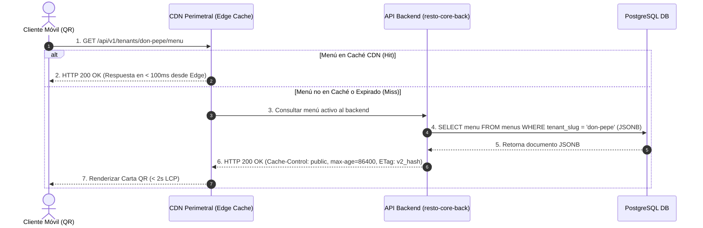

# 0005-presupuesto-latencia-y-cache-cdn

* **Estado:** Proposed
* **Fecha:** 2026-08-17
* **Autores:** Equipo de Arquitectura RestoCore

---

## Contexto y Planteamiento del Problema

La **Carta QR pública** es el punto de contacto principal entre el restaurante y el cliente final. Tras escanear el código QR en la mesa, el cliente accede al menú digital utilizando navegadores web en dispositivos móviles que operan frecuentemente bajo redes celulares 3G/4G/5G con latencia o ancho de banda variable.

Estudios de experiencia de usuario demuestran que tiempos de carga superiores a 2 segundos en menús digitales generan frustración, incrementan la tasa de abandono y degradan la percepción del servicio gastronómico. Para garantizar una experiencia fluida y escalable, el proyecto requiere fijar un presupuesto estricto de rendimiento e instrumentar la infraestructura de caché perimetral necesaria.

---

## Fuerzas Impulsoras (Decision Drivers)

* **Presupuesto de Latencia (< 2s LCP):** El renderizado del elemento de contenido principal (*Largest Contentful Paint*) en dispositivos móviles debe completar en menos de 2.0 segundos.
* **Tiempo de Respuesta del Backend (< 500ms):** El tiempo de procesamiento del servidor API principal (`resto-core-back`) para endpoints dinámicos no debe superar los 500ms.
* **Escalabilidad de Lectura Masiva:** El sistema debe soportar picos de alta concurrencia (ejemplo: horarios de almuerzo/cena) sin saturar la base de datos PostgreSQL.
* **Invalidación Instantánea de Caché:** Cuando el administrador modifica un plato, precio o categoría en el Panel CRUD, los cambios deben reflejarse de inmediato en la Carta QR pública.

---

## Opciones Consideradas

### Opción 1: Estrategia de Caching CDN Perimetral con Versionado de Menú e Invalidación Activa (Seleccionada)
Servir la Carta QR pública a través de una red de distribución de contenido (**CDN perimetral**) de baja latencia. El menú del restaurante incluye un hash o identificador de versión (`version_hash`). Las respuestas HTTP de la Carta QR se entregan con cabeceras de control de caché optimizadas (`Cache-Control: public, max-age=86400, stale-while-revalidate=3600`). Cuando el administrador realiza un cambio en el Panel CRUD, el backend actualiza el `version_hash` del Tenant, forzando a los clientes a consultar la versión actualizada.

* **Ventajas:**
  - Garantiza tiempos de respuesta de lectura en el borde de la red (edge) en menos de 100ms.
  - Cumplimiento holgado del presupuesto de latencia < 2s LCP en móviles.
  - La base de datos PostgreSQL solo procesa solicitudes cuando el menú sufre mutaciones o cuando caduca la versión.
  - Alta resiliencia: Si la base de datos sufre una degradación temporal, la CDN sigue sirviendo la Carta QR estática.
* **Desventajas / Trade-offs:**
  - Requiere administrar el campo `version_hash` en la tabla `menus` de PostgreSQL.

### Opción 2: Consultas Directas a PostgreSQL en Cada Escaneo (Sin CDN)
Cada vez que un cliente escanea el QR, la solicitud HTTP viaja directamente al backend y ejecuta la consulta SQL a PostgreSQL.

* **Desventajas / Razones de Descarte:**
  - Satura la base de datos en horarios pico.
  - Incompatible con el presupuesto de latencia < 2s LCP bajo conexiones móviles lentas.

### Opción 3: Uso de GraphQL con Caching Dinámico en Servidor
Implementar un servidor GraphQL para que el cliente solicite campos específicos del menú.

* **Desventajas / Razones de Descarte:**
  - Incumple el Inviolable #1 de `AGENTS.md` (Uso exclusivo de REST API).
  - Dificulta el almacenamiento en caché a nivel de CDN perimetral debido a solicitudes HTTP `POST`.

---

## Decisión Seleccionada

Se selecciona la **Opción 1: Estrategia de Caching CDN Perimetral con Versionado de Menú e Invalidación Activa**.

### Arquitectura de Caché Perimetral:

---

## Consecuencias

* **Positivas:**
  - Garantiza el cumplimiento del Inviolable #2 de `AGENTS.md` (< 2s LCP).
  - Reduce la carga de CPU e I/O en PostgreSQL en más de un 95% para operaciones de lectura.
  - Resiliencia garantizada ante fallas de infraestructura backend.
* **Negativas / Desafíos:**
  - El Panel de Administración CRUD debe incrementar el `version_hash` del menú en cada mutación aceptada.

---

## Enlaces y Referencias
* Directrices de Gobernanza: [AGENTS.md](../../AGENTS.md) (Inviolable #2 - Presupuesto de Latencia < 2s LCP).
* Especificación de API: [specs/openapi.yaml](../../specs/openapi.yaml).
* Registro de Persistencia: [ADR-0003](./0003-seleccion-de-postgresql-con-jsonb-para-persistencia-semiestructurada.md).
