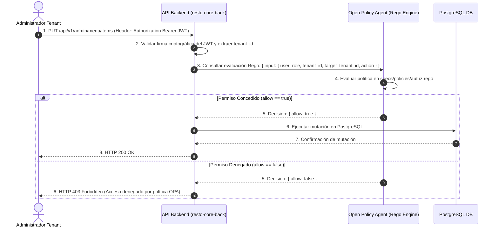

# 0006-seguridad-declarativa-opa-rego

* **Estado:** Proposed
* **Fecha:** 2026-08-17
* **Autores:** Equipo de Arquitectura RestoCore

---

## Contexto y Planteamiento del Problema

El ecosistema RestoCore opera como una plataforma SaaS multi-tenant que gestiona múltiples roles de usuario con diferentes niveles de privilegio:
* **SuperAdmin:** Administración global del ecosistema y alta de restaurantes.
* **Admin Tenant:** Gestión del catálogo de menú, mesas y configuración de su propio local.
* **Staff / Mozo:** Visualización y atención de pedidos en salón.
* **Cliente Público:** Acceso anónimo a la Carta QR en modo solo lectura.

Codificar la lógica de autorización (evaluación de permisos, roles y propiedad de recursos) directamente mediante condicionales `if/else` en el código fuente de los controladores o middlewares del backend (`resto-core-back`) introduce graves riesgos de mantenibilidad y seguridad:
1. **Dispersión de Reglas de Seguridad:** Las políticas de acceso quedan fragmentadas a lo largo de múltiples módulos de código.
2. **Riesgo de Filtrado Multi-Tenant (Cross-Tenant Data Leaks):** Errores involuntarios de programación pueden permitir que un Administrador del Tenant A modifique recursos del Tenant B.
3. **Imposibilidad de Auditoría Centralizada:** Dificultad para auditar y certificar matemáticamente qué permisos se otorgan en cada endpoint.

---

## Fuerzas Impulsoras (Decision Drivers)

* **Security-as-Code:** Las políticas de seguridad deben tratarse como artefactos de código versionados, probados y auditables exclusivamente en Git.
* **Desacoplamiento Total:** La lógica de "quién puede hacer qué" debe estar desacoplada de la implementación técnica de la API backend.
* **Garantía de Aislamiento Multi-Tenant:** Garantizar de forma determinista que ningún usuario acceda a datos pertenecientes a otro Tenant.
* **Evaluación en Microsegundos:** La comprobación de permisos no debe penalizar el tiempo de respuesta del backend (< 500ms).

---

## Opciones Consideradas

### Opción 1: Autorización Declarativa Desacoplada con Open Policy Agent (OPA / Rego) (Seleccionada)
Adoptar el estándar de la Cloud Native Computing Foundation (CNCF) **Open Policy Agent (OPA)**. Las políticas de autorización se redactan de forma declarativa en lenguaje **Rego** y se persisten en el repositorio de especificaciones bajo el directorio `/specs/policies/`. Al recibir una solicitud HTTP protegida en `/api/v1/admin/*`, el backend decodifica el token JWT y envía la carga útil a OPA en formato JSON (`{ input: { user, action, resource, tenant_id } }`). OPA evalúa la regla Rego y retorna una decisión booleana limpia (`allow: true/false`).

* **Ventajas:**
  - Centralización y transparencia total de las reglas de acceso en `specs/policies/`.
  - Prueba de políticas de seguridad aisladas mediante el runner nativo de OPA (`opa test`).
  - Cero condicionales de autorización dispersos en el código de backend.
  - Aplicación consistente de reglas multi-tenant.
* **Desafíos:**
  - Requiere que el equipo de desarrollo mantenga y pruebe archivos de política Rego.

### Opción 2: Lógica de Autorización en Middleware/Controladores del Backend
Implementar verificaciones de roles e identificadores de Tenant mediante código imperativo en Node.js/TypeScript o Java dentro del repositorio de backend.

* **Desventajas / Razones de Descarte:**
  - Dificulta la auditoría de seguridad y propicia la duplicación de código.
  - Alto riesgo de vulnerabilidades de elevación de privilegios o acceso cruzado entre Tenants.

### Opción 3: Matriz de Permisos en Base de Datos Relacional (RBAC Tradicional en Tablas)
Almacenar tablas de `roles`, `permissions` y `user_roles` en PostgreSQL y consultarlas en cada solicitud.

* **Desventajas / Razones de Descarte:**
  - Genera sobrecarga de lecturas adicionales a PostgreSQL en cada solicitud protegida.
  - Complejidad para representar reglas contextuales de propiedad de recursos multi-tenant.

---

## Decisión Seleccionada

Se selecciona la **Opción 1: Autorización Declarativa Desacoplada con Open Policy Agent (OPA / Rego)**.

### Flujo de Evaluación de Seguridad:



---

## Ejemplo de Política Rego (`specs/policies/authz.rego`)

```rego
package restocore.authz

default allow = false

# Permitir al Administrador de Tenant modificar recursos exclusivamente de su propio Tenant
allow {
    input.user.role == "tenant_admin"
    input.action == "update"
    input.user.tenant_id == input.resource.tenant_id
}

# Permitir al SuperAdmin gestionar cualquier Tenant
allow {
    input.user.role == "super_admin"
}
```

---

## Consecuencias

* **Positivas:**
  - Seguridad declarativa verdaderamente auditable bajo la filosofía *Docs-as-Code*.
  - Eliminación total de vulnerabilidades de acceso cruzado entre restaurantes (*cross-tenant data leaks*).
  - Verificación automatizable en pipelines de CI/CD mediante `opa test specs/policies/`.
* **Negativas / Desafíos:**
  - Adición del contenedor/sidecar de OPA en el entorno de despliegue de infraestructura.

---

## Enlaces y Referencias
* Especificaciones de Seguridad: Politicas OPA Rego en `specs/policies/`.
* Registro SDD: [ADR-0001](./0001-adopcion-de-spec-driven-development-sdd-y-docs-as-code.md).
