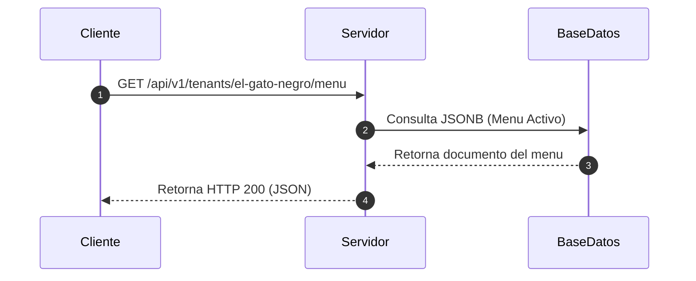

# Guia de Integracion de Especificaciones y Control de Cambios en Docusaurus

Este documento sirve como fuente de conocimiento autoritativa para el agente de inteligencia artificial en el repositorio de especificaciones. Su proposito es definir la arquitectura, configuracion y automatizaciones necesarias para compilar, estructurar y presentar visualmente todo el ecosistema de especificaciones (ADRs, PRDs, contratos OpenAPI, diagramas C4) junto con el historial de Pull Requests (PRs) e integraciones de Git dentro de un portal de documentacion centralizado basado en Docusaurus.

---

## 1. Arquitectura de Segmentacion de Portales (Docs-as-Code)

Para estructurar la informacion de forma adecuada para las distintas audiencias del proyecto (Desarrolladores, Clientes y Usuarios) sin generar redundancias ni desactualizaciones, Docusaurus se configurara utilizando una arquitectura de instancia unica con multiples barras laterales (sidebars), o bien mediante multiples instancias independientes del plugin de documentacion, dependiendo del ciclo de vida del software.

### Enfoque Seleccionado: Instancia Unica con Multiples Sidebars
Dado que el proyecto de menu QR y administracion de restaurante se gestiona de forma centralizada y síncrona en su etapa inicial, la documentacion compartira el mismo ciclo de versionado. Todo el contenido residira bajo directorios estructurados en la carpeta raiz de documentacion:

*   `docs/clientes/`: Documentos de vision, alcance y PRDs de alto nivel.
*   `docs/developers/`: Registros de Decisiones de Arquitectura (ADRs), diagramas C4 y guias tecnicas.
*   `docs/usuarios/`: Guias de uso funcional de la carta QR y el panel de administracion.

### Configuracion del Archivo `sidebars.js`
El archivo de configuracion de barras laterales exportara objetos diferenciados por audiencia. Docusaurus conmutara de manera automatica la navegacion vertical en base al subdirectorio en el que se encuentre el lector:

```javascript
module.exports = {
  clientesSidebar: [
    {
      type: 'category',
      label: 'Especificaciones de Negocio',
      items: [
        'clientes/vision-y-alcance',
        'clientes/prd-menu-qr',
        'clientes/prd-panel-admin'
      ]
    }
  ],
  developersSidebar: [
    {
      type: 'category',
      label: 'Gobernanza y Arquitectura',
      items: [
        'developers/guia-onboarding',
        {
          type: 'category',
          label: 'Decisiones de Arquitectura (ADR)',
          items: [
            'developers/adr/0001-adopcion-sdd',
            'developers/adr/0002-separacion-repositorios',
            'developers/adr/0003-migracion-postgresql'
          ]
        }
      ]
    },
    {
      type: 'category',
      label: 'Especificaciones Tecnicas',
      items: [
        'developers/contrato-api',
        'developers/modelo-c4-sistema'
      ]
    }
  ],
  usuariosSidebar: [
    {
      type: 'category',
      label: 'Manuales de Usuario',
      items: [
        'usuarios/como-escanear-qr',
        'usuarios/gestion-de-platos'
      ]
    }
  ]
};
```

---

## 2. Reutilizacion de Contenido Mediante Partiales MDX

Para mantener el principio de Unica Fuente de la Verdad (Single Source of Truth), los terminos de dominio comun o descripciones tecnicas que se repitan en las secciones de Clientes y Developers se gestionaran a traves de componentes MDX parciales.

De acuerdo con las convenciones de Docusaurus, los archivos cuyos nombres comiencen con un guion bajo (por ejemplo, `_definicion-tenant.mdx`) seran excluidos de la compilacion de rutas automaticas. Estos fragmentos podran ser importados e inyectados en otros archivos Markdown:

```markdown
import DefinicionTenant from './_definicion-tenant.mdx';

# Requisitos del Sistema Multi-tenant

<DefinicionTenant />

A continuacion se detallan los limites de alcance del modulo...
```

---

## 3. Integracion de Diagramas y Representaciones Visuales

La documentacion tecnica no utilizara imagenes estaticas o binarias que tiendan a quedar obsoletas. Toda la representacion grafica de interacciones, secuencias y diagramas C4 se realizara como codigo declarativo mediante Mermaid.js.

### Activacion en `docusaurus.config.js`
Para habilitar el soporte de Mermaid, se debe registrar el tema oficial y activar la compatibilidad en el archivo de configuracion:

```javascript
module.exports = {
  markdown: {
    mermaid: true,
  },
  themes: ['@docusaurus/theme-mermaid'],
  themeConfig: {
    mermaid: {
      theme: { light: 'neutral', dark: 'forest' },
    },
  },
};
```

Los diagramas se escribiran en bloques de codigo Markdown estandar, permitiendo que Docusaurus los renderice dinamicamente como graficos vectoriales (SVG) que se adaptan de forma nativa al modo claro u oscuro del portal:

```markdown

```

---

## 4. Visualizacion del Historial de Pull Requests, Cambios y Entornos de Vista Previa

La documentacion debe reflejar en tiempo real la actividad del repositorio de Git. Esto incluye tanto los cambios aplicados en las especificaciones (PRDs, ADRs, contratos API) como las discusiones y resoluciones de los Pull Requests.

Para maximizar la agilidad, la documentacion debe poder visualizarse de manera preliminar **antes** de consolidarse en la rama principal. Esto se logra mediante entornos de vista previa (*Deploy Previews*) vinculados a cada Pull Request abierto.

### Flujo de Trabajo para Entornos de Vista Previa (Deploy Previews)

Cada vez que un desarrollador abre o actualiza un Pull Request en el repositorio de especificaciones, el pipeline de CI compila una version de Docusaurus con las especificaciones propuestas y la despliega en un entorno de pruebas aislado (por ejemplo, utilizando Netlify, Vercel o directorios de staging en GitHub Pages). Esto permite al equipo tecnico y de producto revisar el impacto visual y la consistencia del cambio antes de su aprobacion.

### Flujo de Trabajo para la Generacion del Changelog de PRs Fusionados

Una vez que el Pull Request es aprobado y fusionado en la rama principal (`main`), el pipeline de integracion continua ejecuta un script que extrae de manera automatica el historial del PR y actualiza la pagina `docs/developers/historial-cambios.md`.

#### Script de Automatizacion (`scripts/generate-changelog.js`)

Este script utiliza la API de Git para consultar los ultimos PRs cerrados y fusionados que afectaron a las especificaciones y genera un archivo Markdown compatible con el portal:

```javascript
const fs = require('fs');
const { Octokit } = require("@octokit/rest");

const octokit = new Octokit({ auth: process.env.GITHUB_TOKEN });
const OWNER = 'tu-organizacion';
const REPO = 'menu-specs';

async function generateChangelog() {
  try {
    const { data: pulls } = await octokit.pulls.list({
      owner: OWNER,
      repo: REPO,
      state: 'closed',
      sort: 'updated',
      direction: 'desc',
      per_page: 30
    });

    let markdownContent = `# Historial de Cambios e Integraciones (Pull Requests)\\n\\n`;
    markdownContent += `Este documento muestra de manera automatica las modificaciones aplicadas al repositorio de especificaciones del proyecto de menus QR. Es generado por el pipeline de Integracion Continua tras la fusion de cada Pull Request.\\n\\n`;

    pulls.forEach(pr => {
      if (pr.merged_at) {
        const date = new Date(pr.merged_at).toLocaleDateString('es-ES', {
          year: 'numeric',
          month: 'long',
          day: 'numeric'
        });

        markdownContent += `## PR #${pr.number}: ${pr.title}\\n`;
        markdownContent += `*   **Autor:** @${pr.user.login}\\n`;
        markdownContent += `*   **Fecha de Fusion:** ${date}\\n`;
        markdownContent += `*   **Enlace de Revision:** [Ver en GitHub](${pr.html_url})\\n\\n`;
        
        if (pr.body) {
          markdownContent += `### Descripcion del Cambio\\n${pr.body}\\n\\n`;
        }
        markdownContent += `---\\n\\n`;
      }
    });

    fs.writeFileSync('docs/developers/historial-cambios.md', markdownContent);
    console.log('Historial de cambios generado con exito en docs/developers/historial-cambios.md');
  } catch (error) {
    console.error('Error al generar el historial de cambios:', error);
    process.exit(1);
  }
}

generateChangelog();
```

### Automatizacion en el Pipeline (GitHub Actions Workflow con Deploy Previews)

El archivo `.github/workflows/deploy-docs.yml` gestionara el despliegue de produccion al fusionar en `main`, asi como la creacion automatica de entornos de vista previa para Pull Requests abiertos:

```yaml
name: Despliegue de Portal de Documentacion

on:
  push:
    branches:
      - main
  pull_request:
    branches:
      - main

jobs:
  deploy:
    runs-on: ubuntu-latest
    steps:
      - name: Descargar codigo del repositorio
        uses: actions/checkout@v4
        with:
          fetch-depth: 0

      - name: Configurar Node.js
        uses: actions/setup-node@v4
        with:
          node-version: 20
          cache: 'npm'

      - name: Instalar dependencias
        run: npm ci

      # El historial de cambios unificado en produccion solo se genera para la rama principal
      - name: Generar Historial de Pull Requests (Solo en Rama Principal)
        if: github.event_name == 'push' && github.ref == 'refs/heads/main'
        run: node scripts/generate-changelog.js
        env:
          GITHUB_TOKEN: ${{ secrets.GITHUB_TOKEN }}

      - name: Compilar sitio estatico de Docusaurus
        run: npm run build

      # CASO 1: Despliegue de Produccion (Push a main)
      - name: Desplegar portal en Produccion (GitHub Pages)
        if: github.event_name == 'push' && github.ref == 'refs/heads/main'
        uses: peaceiris/actions-gh-pages@v3
        with:
          github_token: ${{ secrets.GITHUB_TOKEN }}
          publish_dir: ./build

      # CASO 2: Despliegue de Vista Previa (Pull Request)
      - name: Desplegar Vista Previa (Deploy Preview en Netlify / Vercel o Staging)
        if: github.event_name == 'pull_request'
        uses: rossjansen/deploy-preview-action@v1 # Accion de ejemplo para entornos preview
        with:
          build_dir: ./build
          github_token: ${{ secrets.GITHUB_TOKEN }}
```

---

## 5. Instrucciones de Comportamiento para el Agente

Al operar en el repositorio de especificaciones, el agente debe seguir las siguientes reglas operativas estrictas:

1.  **Visualizacion y Control de Cambios en Tiempo Real:** Cuando el usuario solicite registrar una modificacion de especificaciones (por ejemplo, tras modificar un PRD, redactar clausulas EARS o crear un nuevo ADR), el agente debe informarle de manera proactiva que la propuesta sera accesible visualmente de forma inmediata a traves del **entorno de vista previa (Deploy Preview)** asociado al Pull Request que se abra para dicha modificacion. Debe explicarle que esto permite revisar, navegar e inspeccionar el diseño visual e interactivo de la especificacion de forma previa a la aprobacion, integrándose de forma definitiva en el portal de produccion una vez fusionado el Pull Request en la rama principal.
2.  **Sugerencias de Redaccion Visual:** Ante la propuesta de añadir nuevos diagramas, el agente rechazara la inclusion de formatos de imagen estaticos (PNG, JPEG) y proporcionara obligatoriamente la estructura correspondiente escrita en bloques de codigo Mermaid.js compatible con Docusaurus.
3.  **Coherencia de Referencias Cruzadas:** Al redactar un PRD o un ADR, el agente debe validar que los enlaces internos sigan la estructura de rutas relativas de Docusaurus para evitar enlaces rotos durante la compilacion.
4.  **Uso de MDX Partiales para Evitar Duplicaciones:** El agente recomendara de manera proactiva la extraccion de definiciones complejas de negocio a archivos parciales que comiencen con un guion bajo, permitiendo que la misma definicion sea consumida sin discrepancias semanticas tanto por clientes de negocio como por ingenieros de desarrollo.
